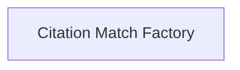

# Citation Fuzzy Match Module

The `citation_fuzzy_match` module is responsible for enabling language models to answer questions with precise and exact citations from provided contexts. It offers functionalities to create both traditional LLMChains and modern Runnable interfaces for citation-aware question answering.

## Architecture Overview

The `citation_fuzzy_match` module primarily consists of a factory for creating citation matching components.

<!-- DIAGRAM_JSON
{
    "direction": "TD",
    "nodes": [
        {"id": "citation_match_factory", "label": "Citation Match Factory", "type": "module", "link": "citation_match_factory.md"}
    ],
    "edges": [],
    "groups": []
}
-->

## Sub-modules

### [Citation Match Factory](citation_match_factory.md)
This sub-module provides the core logic and functions for constructing citation-aware question-answering components. It includes utilities to set up language models with structured output capabilities to ensure accurate citation generation.