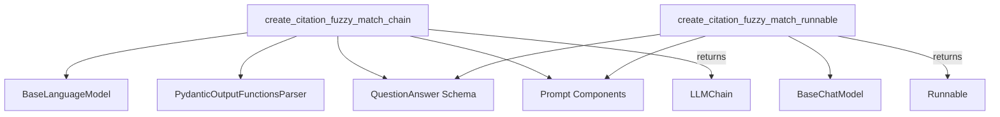

# Module: citation_fuzzy_match_factory

## Introduction
The `citation_fuzzy_match_factory` module provides utility functions for creating language model chains and runnables specifically designed for question-answering with fuzzy citation matching. This module is part of the `classic_chains_openai_functions.citation_fuzzy_match` package, focusing on leveraging OpenAI's function calling capabilities to extract answers along with their corresponding citations from provided context.

## Architecture and Component Relationships
This module contains two primary functions: `create_citation_fuzzy_match_chain` and `create_citation_fuzzy_match_runnable`. Both functions facilitate the creation of mechanisms for citation-aware question answering, but they return different types of objects: an `LLMChain` for the former and a `Runnable` for the latter, catering to different integration patterns within the LangChain framework.

Both components rely on a `QuestionAnswer` Pydantic schema (defined within the broader `classic_chains_openai_functions` module) to structure the output, ensuring that answers include both the textual response and the source citations.

<!-- DIAGRAM_JSON
{
    "direction": "TD",
    "nodes": [
        {"id": "create_chain", "label": "create_citation_fuzzy_match_chain", "type": "component", "link": null},
        {"id": "create_runnable", "label": "create_citation_fuzzy_match_runnable", "type": "component", "link": null},
        {"id": "llm_base", "label": "BaseLanguageModel", "type": "external", "link": "core_language_models.md"},
        {"id": "chat_llm_base", "label": "BaseChatModel", "type": "external", "link": "core_language_models.md"},
        {"id": "llm_chain", "label": "LLMChain", "type": "external", "link": "classic_chains_base.md"},
        {"id": "runnable", "label": "Runnable", "type": "external", "link": "core_runnables.md"},
        {"id": "pydantic_parser", "label": "PydanticOutputFunctionsParser", "type": "external", "link": "core_output_parsers.md"},
        {"id": "question_answer_schema", "label": "QuestionAnswer Schema", "type": "external", "link": "classic_chains_openai_functions.md#question-answering"},
        {"id": "prompts", "label": "Prompt Components", "type": "external", "link": "core_prompts.md"}
    ],
    "edges": [
        {"source": "create_chain", "target": "llm_base"},
        {"source": "create_chain", "target": "pydantic_parser"},
        {"source": "create_chain", "target": "question_answer_schema"},
        {"source": "create_chain", "target": "prompts"},
        {"source": "create_chain", "target": "llm_chain", "label": "returns"},
        {"source": "create_runnable", "target": "chat_llm_base"},
        {"source": "create_runnable", "target": "question_answer_schema"},
        {"source": "create_runnable", "target": "prompts"},
        {"source": "create_runnable", "target": "runnable", "label": "returns"}
    ],
    "groups": []
}
-->

## Core Components

### `create_citation_fuzzy_match_chain`
This function constructs an `LLMChain` configured to answer questions and provide fuzzy citations based on the context. It utilizes a `BaseLanguageModel` and integrates with OpenAI's function calling through a `PydanticOutputFunctionsParser` to enforce the `QuestionAnswer` schema for structured output. The chain is initialized with a specific `SystemMessage` and `HumanMessagePromptTemplate` instances to guide the language model in generating accurate and cited responses.

**Parameters:**
- `llm`: An instance of `BaseLanguageModel` used for processing the prompts.

**Returns:**
- An `LLMChain` instance capable of performing citation-aware question answering.

### `create_citation_fuzzy_match_runnable`
This function creates a `Runnable` for citation fuzzy matching. Unlike `create_citation_fuzzy_match_chain`, it requires a `BaseChatModel` that implements the `bind_tools` method, allowing for direct integration with chat models capable of structured output. The runnable combines a `ChatPromptTemplate` with the language model's structured output capabilities to ensure responses adhere to the `QuestionAnswer` schema, providing answers with exact citations.

**Parameters:**
- `llm`: An instance of `BaseChatModel` that supports `bind_tools` for structured output.

**Returns:**
- A `Runnable` instance designed for citation-aware question answering.

**Raises:**
- `ValueError`: If the provided `llm` does not implement the `bind_tools` method.
