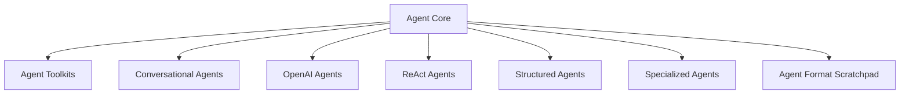

# `classic_agents` Module Overview

## Purpose of the Module

The `classic_agents` module provides a comprehensive framework for building and managing intelligent agents within the classic LangChain architecture. It encompasses various agent types, from foundational abstract classes to specialized implementations like conversational, ReAct, and structured agents. This module facilitates the creation of agents capable of reasoning, acting, and interacting with tools and language models to accomplish complex tasks. It also includes utilities for agent initialization, output parsing, and managing agent-specific functionalities.

## Architecture Overview

The `classic_agents` module is structured into several key sub-modules, each focusing on a distinct aspect of agent functionality. These sub-modules work together to provide a robust and flexible framework for agent development.

## Core Components Documentation

Here's a brief overview of the key sub-modules within `classic_agents`:

### [Agent Core](agent_core.md)
The `agent_core` module serves as the foundational layer for managing and interacting with agents within the classic LangChain framework. It defines the basic structure of agents, handles their initialization, enumerates available agent types, and includes utilities for deprecation warnings.

### [Agent Toolkits](agent_toolkits.md)
The `agent_toolkits` module provides a set of utilities and convenience methods for constructing various types of agents within the `langchain_classic.agents` framework. This module aims to simplify the creation of agents tailored for specific tasks, such as conversational retrieval and interaction with vector stores.

### [Conversational Agents](conversational_agents.md)
The `conversational_agents` module within `langchain_classic.agents` provides a suite of tools and classes for building intelligent agents capable of engaging in conversational interactions and leveraging external tools to achieve tasks.

### [OpenAI Agents](openai_agents.md)
The `openai_agents` module provides a comprehensive set of tools and utilities for building and managing intelligent agents leveraging OpenAI's advanced capabilities, including Assistants, function calling, and custom tools.

### [ReAct Agents](react_agents.md)
The `react_agents` module provides tools and implementations for creating agents based on the ReAct (Reasoning and Acting) prompting framework. ReAct agents synergize reasoning and acting in language models, enabling them to solve tasks that require dynamic interaction with their environment.

### [Structured Agents](structured_agents.md)
The `structured_agents` module provides a foundational framework for developing agents that interact with large language models using structured data formats like JSON and XML. It offers various agent types and utilities to handle complex conversational flows, tool utilization, and structured output parsing.

### [Specialized Agents](specialized_agents.md)
The `specialized_agents` module in `langchain_classic` provides a collection of advanced agent architectures designed for specific problem-solving paradigms. These agents extend basic agent functionalities by incorporating specialized reasoning techniques and tool interaction capabilities to handle complex tasks more effectively.

### [Agent Format Scratchpad](agent_format_scratchpad.md)
The `agent_format_scratchpad` module is responsible for formatting intermediate steps of an agent's execution into a list of messages suitable for further processing by a language model. This module plays a crucial role in the agent's decision-making loop by transforming raw agent actions and observations into a structured message format that the LLM can understand and use to generate the next action.