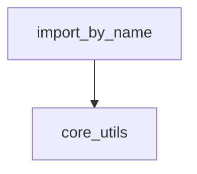

# classic_api Module Documentation

## Introduction

The `classic_api` module serves as a crucial compatibility layer within the system, primarily responsible for managing dynamic imports of components. Its core function is to facilitate the transition between legacy `langchain` imports and newer `langchain_community` imports, providing a centralized mechanism for resolving module paths and issuing deprecation warnings to guide developers.

## Purpose and Core Functionality

The `classic_api` module's main purpose is to ensure backward compatibility while promoting the adoption of updated module structures. It achieves this through its primary function:

### `import_by_name`

The `import_by_name` function is the central piece of this module. It provides a robust way to dynamically import objects by their string name, handling various scenarios including:

*   **Dynamic Module Resolution**: It uses an internal lookup (`all_module_lookup`) to map deprecated or legacy component names to their new module paths, often redirecting to `langchain_community`.
*   **Top-Level Package Enforcement**: It validates that imports originate from allowed top-level packages (`ALLOWED_TOP_LEVEL_PKGS`) to maintain system integrity and prevent unauthorized imports.
*   **Deprecation Warnings**: For components that have been moved or renamed, `import_by_name` issues clear deprecation warnings to non-internal callers, guiding them to update their import statements to the new module locations. This is crucial for maintaining code hygiene and ensuring smooth transitions between library versions.
*   **Fallback Mechanism**: In cases where a direct lookup fails, a `fallback_module` can be used to attempt the import, further enhancing compatibility.
*   **Error Handling**: It provides specific `ModuleNotFoundError` messages for `langchain_community` modules, prompting users to install the necessary package, and raises `AttributeError` if the imported module lacks the requested attribute.

## Architecture and Component Relationships

The `classic_api` module is lightweight, focusing on the `import_by_name` utility. Its architecture is designed for efficient and guided module resolution.

<!-- DIAGRAM_JSON
{
    "direction": "TD",
    "nodes": [
        {"id": "import_by_name", "label": "import_by_name", "type": "component", "link": null},
        {"id": "core_utils", "label": "core_utils", "type": "external", "link": "core_utils.md"}
    ],
    "edges": [
        {"source": "import_by_name", "target": "core_utils"}
    ],
    "groups": []
}
-->

**Component Breakdown:**

*   **`import_by_name`**: (Internal Component) This is the sole core component of the `classic_api` module. It encapsulates the logic for dynamic module importing, path resolution, and deprecation warning generation.

**External Dependencies:**

*   **`core_utils`**: (External Module) The `import_by_name` function leverages utilities from the [core_utils](core_utils.md) module, specifically for determining if the execution environment is interactive (`is_interactive_env`) and for issuing structured deprecation warnings (`warn_deprecated`). It may also implicitly interact with internal modules (like `internal.is_caller_internal`) which might be part of `core_utils` or a similar internal utility module, though not explicitly exposed in the module tree.
*   **`importlib`**: (Python Standard Library) Used for programmatically importing modules at runtime.

## How the Module Fits into the Overall System

The `classic_api` module plays a vital role in maintaining the stability and evolvability of the system by:

*   **Facilitating API Transitions**: It acts as a bridge during significant refactoring or reorganization of the library, allowing older codebases to continue functioning while providing clear guidance for migration to new APIs.
*   **Enforcing Best Practices**: By restricting imports to `ALLOWED_TOP_LEVEL_PKGS` and issuing deprecation warnings, it helps ensure developers use the recommended and current interfaces, reducing technical debt over time.
*   **Improving Developer Experience**: It provides helpful error messages for missing `langchain_community` installations, streamlining the setup process for users.

In essence, `classic_api` underpins the system's ability to gracefully evolve its API surface without breaking existing applications, making it an indispensable part of the library's long-term maintenance strategy.