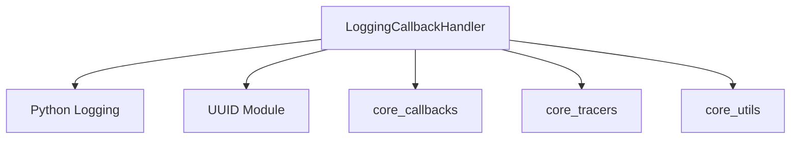

# classic_callbacks_tracers Module Documentation

<!-- DIAGRAM_JSON
{
    "direction": "TD",
    "nodes": [
        {"id": "logging_callback_handler", "label": "LoggingCallbackHandler", "type": "component", "link": null},
        {"id": "python_logging", "label": "Python Logging", "type": "external", "link": null},
        {"id": "uuid_module", "label": "UUID Module", "type": "external", "link": null},
        {"id": "core_callbacks", "label": "core_callbacks", "type": "external", "link": "core_callbacks.md"},
        {"id": "core_tracers", "label": "core_tracers", "type": "external", "link": "core_tracers.md"},
        {"id": "core_utils", "label": "core_utils", "type": "external", "link": "core_utils.md"}
    ],
    "edges": [
        {"source": "logging_callback_handler", "target": "python_logging"},
        {"source": "logging_callback_handler", "target": "uuid_module"},
        {"source": "logging_callback_handler", "target": "core_callbacks"},
        {"source": "logging_callback_handler", "target": "core_tracers"},
        {"source": "logging_callback_handler", "target": "core_utils"}
    ],
    "groups": []
}
-->

### Module: `classic_callbacks_tracers`

This module provides specialized callback handlers for classic LangChain components, focusing on integrating logging functionalities into the tracing system. It contains the `LoggingCallbackHandler` which allows for detailed logging of various events during the execution of LangChain operations.

### Architecture and Component Relationships

The `classic_callbacks_tracers` module is a leaf module that provides a concrete implementation of a callback handler for logging. It depends on standard Python libraries like `logging` and `uuid`, and also integrates with the core `callbacks` and `tracers` modules for its base functionality and exception handling. Utility functions from `core_utils` are used for text formatting in logs.

### Core Components

#### `LoggingCallbackHandler`

-   **Purpose:** This class acts as a tracer that facilitates logging of events, particularly text-based outputs, during the execution of LangChain components. It extends `FunctionCallbackHandler` to inject custom logging logic.
-   **Key Functionality:**
    *   **Initialization (`__init__`)**:
        *   Takes a `logging.Logger` instance, a `log_level` (defaulting to `logging.INFO`), and an optional `extra` dictionary for additional log context.
        *   Dynamically determines the logging method (e.g., `logger.info`, `logger.debug`) based on the provided `log_level`.
        *   Sets up a `callback` function that uses this determined log method to output messages.
        *   Passes this `callback` to its superclass, `FunctionCallbackHandler`.
    *   **`on_text` Method**:
        *   Overrides the `on_text` method from its base class to provide specific logging behavior when new text is generated during a run.
        *   It constructs a formatted log message, including breadcrumbs for context (retrieved from the current run) and the actual text.
        *   Uses `get_colored_text` and `get_bolded_text` (from `core_utils`) to enhance the readability of the log output.
        *   Calls the internal `function_callback` (set during initialization) to perform the actual logging via the configured `logger`.

### How it Fits into the Overall System

The `classic_callbacks_tracers` module, specifically the `LoggingCallbackHandler`, is an integral part of the observability and debugging infrastructure in classic LangChain applications. By providing a standardized way to log events, it enables developers to:
- Monitor the flow of operations within LangChain chains and agents.
- Debug issues by inspecting detailed text outputs and run contexts.
- Integrate LangChain tracing seamlessly with existing logging systems.

It leverages the base callback and tracing mechanisms provided by the [core_callbacks](core_callbacks.md) and [core_tracers](core_tracers.md) modules, acting as a specialized implementation for logging purposes. It ensures that critical information, especially text generation and processing, is captured and made available through the configured logging system.
