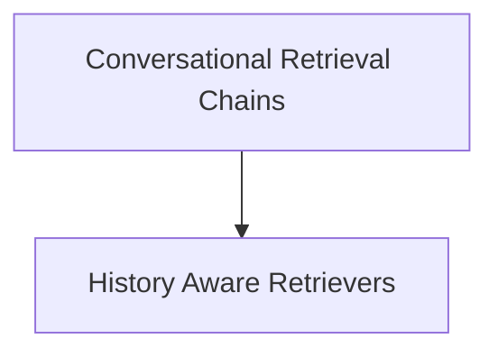

# `classic_chains_conversational` Module Documentation

## Introduction
This module provides foundational components for building conversational retrieval chains in the classic LangChain framework. It enables the creation of intelligent agents that can engage in multi-turn conversations, leveraging chat history to retrieve relevant documents and formulate informed responses.

## Architecture Overview
The `classic_chains_conversational` module is composed of two main sub-modules: `conversational_retrieval_chains` and `history_aware_retrievers`. These components work together to manage conversational context and integrate document retrieval into chat-based applications.

<!-- DIAGRAM_JSON
{
    "direction": "TD",
    "nodes": [
        {"id": "conversational_retrieval_chains", "label": "Conversational Retrieval Chains", "type": "module", "link": "conversational_retrieval_chains.md"},
        {"id": "history_aware_retrievers", "label": "History Aware Retrievers", "type": "module", "link": "history_aware_retrievers.md"}
    ],
    "edges": [
        {"source": "conversational_retrieval_chains", "target": "history_aware_retrievers"}
    ],
    "groups": []
}
-->

## Sub-modules

### `conversational_retrieval_chains`
This sub-module focuses on the implementation of conversational retrieval chains, including both legacy and modern approaches. It defines how chat history and new questions are processed to retrieve relevant information and generate coherent answers.
For more details, refer to [conversational_retrieval_chains.md](conversational_retrieval_chains.md).

### `history_aware_retrievers`
This sub-module contains utilities for constructing retrievers that are aware of the conversation history. It provides mechanisms to transform a user's question, given the chat history, into a standalone question suitable for document retrieval, ensuring context is maintained across turns.
For more details, refer to [history_aware_retrievers.md](history_aware_retrievers.md).
