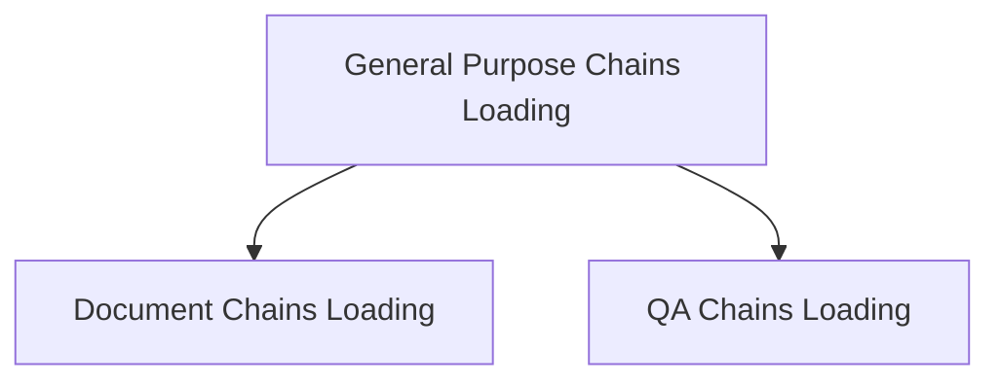

# Classic Chains Loading Module Documentation

The `classic_chains_loading` module is responsible for dynamically loading and initializing various types of chains used within the LangChain Classic framework. It provides a centralized mechanism to construct complex chain configurations from dictionaries or file paths, ensuring flexibility and reusability of chain definitions.

## Architecture Overview

The module is logically divided into several sub-modules, each focusing on loading specific categories of chains. This modular design enhances maintainability and allows for clear separation of concerns.

<!-- DIAGRAM_JSON
{
    "direction": "TD",
    "nodes": [
        {"id": "document_chains_loading", "label": "Document Chains Loading", "type": "module", "link": "document_chains_loading.md"},
        {"id": "general_purpose_chains_loading", "label": "General Purpose Chains Loading", "type": "module", "link": "general_purpose_chains_loading.md"},
        {"id": "qa_chains_loading", "label": "QA Chains Loading", "type": "module", "link": "qa_chains_loading.md"}
    ],
    "edges": [
        {"source": "general_purpose_chains_loading", "target": "document_chains_loading"},
        {"source": "general_purpose_chains_loading", "target": "qa_chains_loading"}
    ],
    "groups": []
}
-->

## Sub-modules

### [Document Chains Loading](document_chains_loading.md)
This sub-module manages the loading of chains specifically designed for document processing tasks, such as combining, refining, and transforming documents within various workflows.

### [General Purpose Chains Loading](general_purpose_chains_loading.md)
This sub-module provides functionality for loading a variety of general-purpose chains, including those for basic LLM interactions, mathematical operations, and external API calls.

### [QA Chains Loading](qa_chains_loading.md)
This sub-module focuses on loading different types of Question-Answering (QA) chains, supporting retrieval-based QA, vector database interactions, and specialized graph-based QA systems.