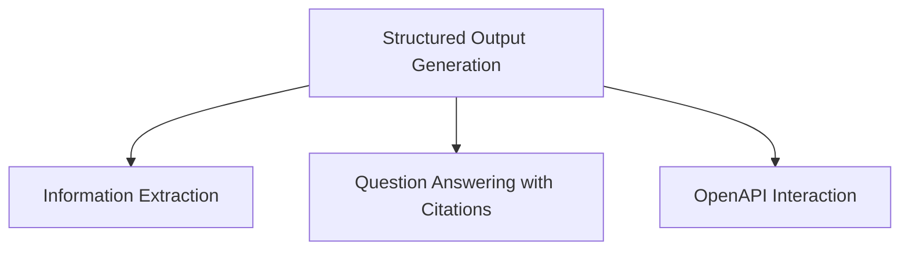

# `classic_chains_openai_functions` Module Documentation

## Introduction and Purpose

The `classic_chains_openai_functions` module provides a collection of utility functions and chains designed to leverage OpenAI's function-calling capabilities within the LangChain framework. This module enables developers to integrate advanced functionalities such as structured output generation, information extraction, question answering with citations, and OpenAPI-based API interactions directly into their language model applications.

It serves as a crucial bridge for building intelligent agents that can understand and execute complex tasks by interacting with external tools and systems through structured function calls.

## Architecture Overview

The `classic_chains_openai_functions` module is logically divided into several sub-modules, each focusing on a specific aspect of OpenAI function integration. These sub-modules are designed to be composable, allowing for flexible and powerful chain construction.

<!-- DIAGRAM_JSON
{
    "direction": "TD",
    "nodes": [
        {"id": "structured_output_generation", "label": "Structured Output Generation", "type": "module", "link": "structured_output_generation.md"},
        {"id": "information_extraction", "label": "Information Extraction", "type": "module", "link": "information_extraction.md"},
        {"id": "question_answering", "label": "Question Answering with Citations", "type": "module", "link": "question_answering.md"},
        {"id": "api_interaction", "label": "OpenAPI Interaction", "type": "module", "link": "api_interaction.md"}
    ],
    "edges": [
        {"source": "structured_output_generation", "target": "information_extraction"},
        {"source": "structured_output_generation", "target": "question_answering"},
        {"source": "structured_output_generation", "target": "api_interaction"}
    ],
    "groups": []
}
-->

## Sub-modules and their Functionality

This module comprises the following key sub-modules:

*   [`structured_output_generation`](structured_output_generation.md): Focuses on creating LLM chains that generate structured outputs based on defined schemas, utilizing OpenAI's function-calling capabilities.
*   [`information_extraction`](information_extraction.md): Provides tools for extracting specific, structured information from unstructured text, supporting both dictionary and Pydantic schemas.
*   [`question_answering`](question_answering.md): Contains functionalities for building robust question-answering systems that can provide answers along with accurate source citations.
*   [`api_interaction`](api_interaction.md): Enables the module to interact with external APIs by dynamically generating and executing API calls based on OpenAPI specifications.
