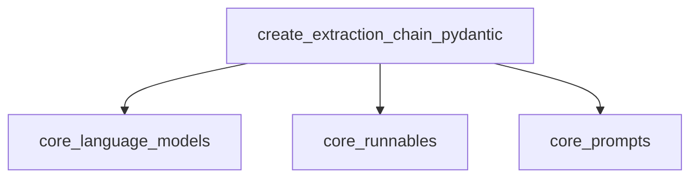

# classic_chains_openai_tools Module Documentation

## Introduction

The `classic_chains_openai_tools` module provides functionalities to create chains that leverage OpenAI's tool-calling capabilities for structured data extraction. It primarily focuses on extracting information from text based on user-defined Pydantic schemas, transforming the extracted data into structured objects.

## Architecture and Component Relationships

This module contains a single core component responsible for orchestrating the data extraction process. It interacts with several core LangChain modules to achieve its functionality.

### Core Components

- **`create_extraction_chain_pydantic`**: This is the main function of the module. It constructs an end-to-end runnable chain that:
    1. Takes a list of Pydantic schemas defining the target data structure.
    2. Converts these Pydantic schemas into OpenAI function definitions (tools).
    3. Binds these tools to a provided Large Language Model (LLM).
    4. Uses a `ChatPromptTemplate` to format the input for the LLM.
    5. Parses the LLM's output, which includes tool calls, back into Pydantic objects using a `PydanticToolsParser`.

### External Dependencies

- **`core_language_models`**: Provides the foundational `BaseLanguageModel` interface, which represents the LLM used in the extraction chain.
- **`core_runnables`**: Supplies the `Runnable` interface, allowing the created extraction chain to be composable and integrated into larger LangChain applications.
- **`core_prompts`**: Offers the `ChatPromptTemplate` for defining the system and user messages used to instruct the LLM during the extraction process.
- **Pydantic**: An external Python library (`BaseModel`) crucial for defining the structure of the data to be extracted. (Note: This is a third-party library and does not have a corresponding `.md` documentation file within this repository's structure).
- **OpenAI Tooling Utilities**: Functions like `convert_pydantic_to_openai_function` and classes like `PydanticToolsParser` are essential for this module's operation. While their specific module within this repository's tree could not be explicitly identified, they represent external dependencies that facilitate the interaction with OpenAI's tool-calling API and the parsing of its structured outputs.

<!-- DIAGRAM_JSON
{
    "direction": "TD",
    "nodes": [
        {"id": "create_extraction_chain_pydantic", "label": "create_extraction_chain_pydantic", "type": "component", "link": null},
        {"id": "core_language_models", "label": "core_language_models", "type": "external", "link": "core_language_models.md"},
        {"id": "core_runnables", "label": "core_runnables", "type": "external", "link": "core_runnables.md"},
        {"id": "core_prompts", "label": "core_prompts", "type": "external", "link": "core_prompts.md"}
    ],
    "edges": [
        {"source": "create_extraction_chain_pydantic", "target": "core_language_models"},
        {"source": "create_extraction_chain_pydantic", "target": "core_runnables"},
        {"source": "create_extraction_chain_pydantic", "target": "core_prompts"}
    ],
    "groups": []
}
-->

## How the Module Fits into the Overall System

The `classic_chains_openai_tools` module plays a crucial role in applications requiring structured data extraction from unstructured text using advanced LLM capabilities. It serves as a specialized chain that seamlessly integrates with the broader LangChain ecosystem by utilizing core components like `BaseLanguageModel`, `Runnable`, and `ChatPromptTemplate`. This module enables developers to define complex extraction rules using Pydantic and execute them efficiently via OpenAI's tool-calling mechanism, making it invaluable for tasks such as entity recognition, fact extraction, and data parsing into predefined formats. It provides a higher-level abstraction for leveraging OpenAI tools for specific data extraction tasks within a LangChain application.
