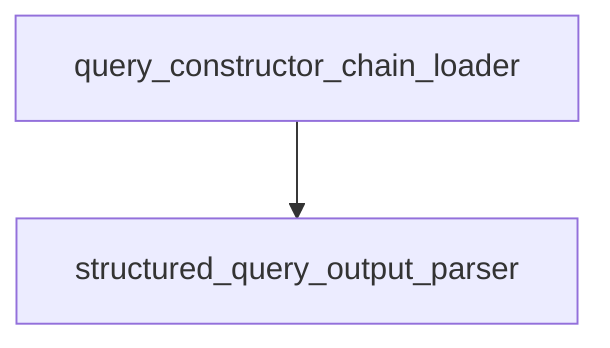

# classic_chains_query_constructor Module Documentation

## Introduction

The `classic_chains_query_constructor` module is responsible for constructing structured queries from natural language inputs. It leverages large language models (LLMs) to interpret user queries and translate them into a structured format that can be used for filtering and retrieving information from documents. This module is crucial for enabling advanced search and retrieval functionalities within the system.

## Architecture Overview

The `classic_chains_query_constructor` module is composed of two main sub-modules:

1.  **Query Chain Loader**: Sets up and configures the LLM chain for query construction.
2.  **Structured Query Output Parser**: Interprets the LLM's output and converts it into a standardized structured query.

<!-- DIAGRAM_JSON
{
    "direction": "TD",
    "nodes": [
        {"id": "query_constructor_chain_loader", "label": "Query Chain Loader", "type": "module", "link": "query_constructor_chain_loader.md"},
        {"id": "structured_query_output_parser", "label": "Structured Query Output Parser", "type": "module", "link": "structured_query_output_parser.md"}
    ],
    "edges": [
        {"source": "query_constructor_chain_loader", "target": "structured_query_output_parser"}
    ],
    "groups": []
}
-->

## Sub-modules

### Query Chain Loader

The `query_constructor_chain_loader` sub-module (`query_constructor_chain_loader.md`) is responsible for orchestrating the creation of the LLM chain used to construct structured queries. It takes various parameters such as the LLM instance, document contents, attribute information, and allowed comparators and operators to build a robust query construction pipeline.

### Structured Query Output Parser

The `structured_query_output_parser` sub-module (`structured_query_output_parser.md`) is designed to parse the raw text output from the LLM into a well-defined `StructuredQuery` object. It handles the extraction of query components, filters, and limits, and can also fix invalid filter directives to ensure the generated queries are syntactically correct and semantically meaningful.