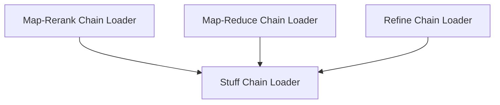

# `classic_chains_question_answering` Module Documentation

## Introduction

The `classic_chains_question_answering` module provides various strategies for building question-answering (QA) chains over documents. These chains are designed to leverage Large Language Models (LLMs) to answer questions based on a given set of input documents, employing different techniques such as stuffing all documents into one prompt, mapping and reducing answers, refining answers iteratively, or mapping and re-ranking potential answers.

## Architecture Overview

The module is structured around a set of loader functions, each responsible for creating and configuring a specific type of document-based question-answering chain. These functions abstract away the complexity of setting up `LLMChain` and `DocumentsChain` instances, allowing developers to easily integrate different QA strategies into their applications.

<!-- DIAGRAM_JSON
{
    "direction": "TD",
    "nodes": [
        {"id": "map_rerank_chain_loader", "label": "Map-Rerank Chain Loader", "type": "module", "link": "map_rerank_chain_loader.md"},
        {"id": "stuff_chain_loader", "label": "Stuff Chain Loader", "type": "module", "link": "stuff_chain_loader.md"},
        {"id": "map_reduce_chain_loader", "label": "Map-Reduce Chain Loader", "type": "module", "link": "map_reduce_chain_loader.md"},
        {"id": "refine_chain_loader", "label": "Refine Chain Loader", "type": "module", "link": "refine_chain_loader.md"}
    ],
    "edges": [
        {"source": "map_rerank_chain_loader", "target": "stuff_chain_loader"},
        {"source": "map_reduce_chain_loader", "target": "stuff_chain_loader"},
        {"source": "refine_chain_loader", "target": "stuff_chain_loader"}
    ],
    "groups": []
}
-->

## Sub-modules

This module contains the following sub-modules, each implementing a distinct strategy for question answering:

*   ### [Map-Rerank Chain Loader](map_rerank_chain_loader.md)
    The `map_rerank_chain_loader` sub-module is responsible for loading and configuring a `MapRerankDocumentsChain`. This chain first processes each document individually to generate a potential answer and a score, then re-ranks these based on the scores to select the best answer.

*   ### [Stuff Chain Loader](stuff_chain_loader.md)
    The `stuff_chain_loader` sub-module facilitates loading a `StuffDocumentsChain`. This straightforward approach "stuffs" all relevant documents into a single prompt for the LLM, making it suitable for scenarios where the combined document length does not exceed the LLM's context window.

*   ### [Map-Reduce Chain Loader](map_reduce_chain_loader.md)
    The `map_reduce_chain_loader` sub-module handles the creation of a `MapReduceDocumentsChain`. This strategy involves processing documents in parallel (map step) to generate initial answers, and then combining these answers (reduce step) to form a final, comprehensive response. It's effective for handling a large number of documents that cannot fit into a single prompt.

*   ### [Refine Chain Loader](refine_chain_loader.md)
    The `refine_chain_loader` sub-module enables the loading of a `RefineDocumentsChain`. This chain works by first generating an initial answer from a subset of documents, and then iteratively refining this answer by considering additional documents one by one. This is particularly useful for complex questions requiring a deep understanding across multiple documents.