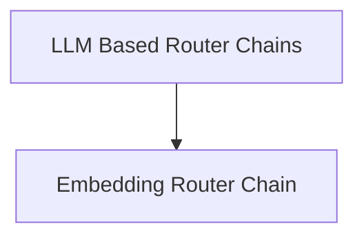

# classic_chains_router Module Documentation

## Introduction

The `classic_chains_router` module provides various routing mechanisms for LangChain, enabling intelligent selection of subsequent chains or actions based on input queries. This module facilitates the creation of complex, dynamic applications by directing requests to specialized sub-chains, optimizing performance and relevance.

## Architecture Overview

The `classic_chains_router` module is designed around the concept of intelligent routing, where different types of router chains determine the appropriate path for an input query. It primarily consists of two core sub-modules:

*   **Embedding Router Chain**: Routes based on semantic similarity using embeddings.
*   **LLM Based Router Chains**: Utilizes Large Language Models for making routing decisions, supporting multi-prompt and multi-retrieval QA scenarios.

<!-- DIAGRAM_JSON
{
    "direction": "TD",
    "nodes": [
        {"id": "embedding_router", "label": "Embedding Router Chain", "type": "module", "link": "embedding_router.md"},
        {"id": "llm_based_routers", "label": "LLM Based Router Chains", "type": "module", "link": "llm_based_routers.md"}
    ],
    "edges": [
        {"source": "llm_based_routers", "target": "embedding_router"}
    ],
    "groups": []
}
-->

## Sub-modules

### [Embedding Router Chain](embedding_router.md)

This sub-module contains `EmbeddingRouterChain`, which uses vector embeddings to find the most similar route for a given query. It is ideal for scenarios where routing decisions can be made based on the semantic content of the input, leveraging a `VectorStore` to compare and select the best destination.

### [LLM Based Router Chains](llm_based_routers.md)

This sub-module encompasses router chains that rely on Large Language Models for dynamic routing. It includes `LLMRouterChain`, `MultiPromptChain`, and `MultiRetrievalQAChain`, enabling sophisticated routing logic for directing queries to appropriate prompts or retrieval augmented generation (RAG) chains.