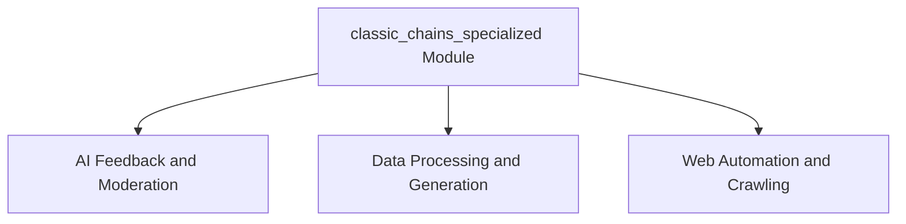

# classic_chains_specialized Module Documentation

## Introduction
The `classic_chains_specialized` module provides a collection of specialized chains designed to address specific advanced use cases in language model applications. These chains range from applying constitutional principles to AI responses and moderating content, to facilitating web automation and performing complex data processing tasks like map-reduce and question-answer generation.

## Architecture Overview

This module is structured into several sub-modules, each focusing on a distinct area of specialized chain functionality. The architecture promotes modularity, allowing for focused development and easier maintenance of complex AI interactions.

<!-- DIAGRAM_JSON
{
    "direction": "TD",
    "nodes": [
        {"id": "ai_feedback_chains", "label": "AI Feedback and Moderation", "type": "module", "link": "ai_feedback_chains.md"},
        {"id": "data_processing_chains", "label": "Data Processing and Generation", "type": "module", "link": "data_processing_chains.md"},
        {"id": "web_automation_chains", "label": "Web Automation and Crawling", "type": "module", "link": "web_automation_chains.md"}
    ],
    "edges": [
        {"source": "classic_chains_specialized", "target": "ai_feedback_chains"},
        {"source": "classic_chains_specialized", "target": "data_processing_chains"},
        {"source": "classic_chains_specialized", "target": "web_automation_chains"}
    ],
    "groups": []
}
-->

## Sub-modules

### [AI Feedback and Moderation](ai_feedback_chains.md)
This sub-module contains chains for enhancing AI responses with self-correction, adherence to constitutional principles, and content moderation. It includes functionalities like critiquing and revising generated text, checking summaries for factual accuracy, and flagging inappropriate content using external moderation services.

### [Data Processing and Generation](data_processing_chains.md)
This section covers chains designed for advanced data handling and content generation. It provides tools for generating new examples based on existing ones, implementing retrieval-augmented generation for more informed responses, processing large documents efficiently using map-reduce techniques, and automatically generating question-answer pairs from provided texts.

### [Web Automation and Crawling](web_automation_chains.md)
This sub-module offers tools for interacting with web browsers in an LLM-driven manner. It includes chains that can interpret user objectives to navigate and interact with web pages, along with a robust crawler utility for extracting and processing web content.
