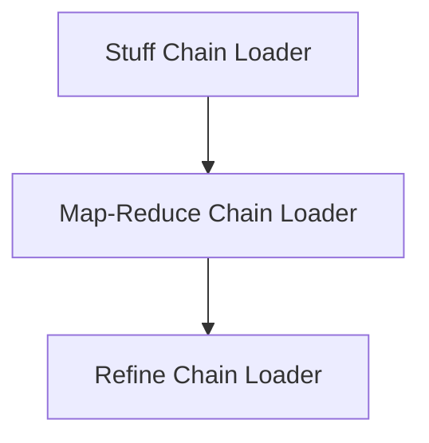

# classic_chains_summarize Module Documentation

## Introduction

The `classic_chains_summarize` module provides various strategies for summarizing documents using different chain types. It encapsulates the logic for combining language models with prompt templates to efficiently condense information from multiple sources. This module is essential for applications requiring document summarization, offering flexible approaches to handle varying document lengths and complexities.

## Architecture Overview

The `classic_chains_summarize` module is composed of three core sub-modules, each implementing a distinct document summarization strategy:

*   **Stuff Chain Loader**: Directly "stuffs" all documents into a single prompt for the language model.
*   **Map-Reduce Chain Loader**: Summarizes documents in a two-step process: first, individual summaries are generated (map), and then these summaries are combined into a final summary (reduce).
*   **Refine Chain Loader**: Iteratively refines a summary by processing documents sequentially, building upon an initial response.

These sub-modules interact with core language model interfaces and prompt templates to execute their summarization tasks.

<!-- DIAGRAM_JSON
{
    "direction": "TD",
    "nodes": [
        {"id": "stuff_chain_loader", "label": "Stuff Chain Loader", "type": "module", "link": "stuff_chain_loader.md"},
        {"id": "map_reduce_chain_loader", "label": "Map-Reduce Chain Loader", "type": "module", "link": "map_reduce_chain_loader.md"},
        {"id": "refine_chain_loader", "label": "Refine Chain Loader", "type": "module", "link": "refine_chain_loader.md"}
    ],
    "edges": [
        {"source": "stuff_chain_loader", "target": "map_reduce_chain_loader"},
        {"source": "map_reduce_chain_loader", "target": "refine_chain_loader"}
    ],
    "groups": []
}
-->

## Sub-modules

### [Stuff Chain Loader](stuff_chain_loader.md)
This sub-module focuses on the "stuffing" method for summarization, where all relevant document content is directly inserted into a single prompt and passed to a language model. It is ideal for shorter documents or when the aggregated content fits within the language model's token limit.

### [Map-Reduce Chain Loader](map_reduce_chain_loader.md)
This sub-module implements the map-reduce approach, which is particularly effective for large sets of documents. It first processes each document independently to create initial summaries (map step) and then combines these summaries into a final coherent output (reduce step). An optional "collapse" step can handle intermediate results that exceed token limits.

### [Refine Chain Loader](refine_chain_loader.md)
This sub-module provides the refine summarization strategy, which is suitable for long documents where context needs to be maintained across multiple processing steps. It works by taking an initial summary and iteratively refining it by incorporating information from subsequent document chunks.
