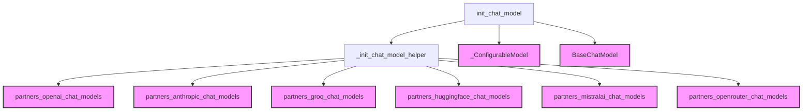

# classic_chat_models Module Documentation

## Introduction

The `classic_chat_models` module provides a unified and flexible interface for initializing chat models from various language model providers. It aims to simplify the process of integrating different chat models into applications by offering both fixed and configurable model instantiations. This module abstracts away the provider-specific initialization details, allowing developers to switch between models and providers with minimal code changes.

## Purpose and Core Functionality

The primary purpose of `classic_chat_models` is to act as a factory for chat model instances. Its core functionality revolves around the `init_chat_model` function, which allows users to:

1.  **Initialize Fixed Models**: Directly specify a model and its provider to get a ready-to-use chat model instance.
2.  **Initialize Configurable Models**: Create a model instance where parameters (including the model name and provider) can be specified or overridden at runtime via configuration. This is particularly useful for building dynamic applications that need to adapt to different user preferences or deployment environments.
3.  **Infer Model Providers**: Automatically detect the model provider based on common model naming conventions if not explicitly provided.
4.  **Support a Wide Range of Providers**: Seamlessly integrate with numerous chat model providers by dynamically loading their respective integration packages.

This module plays a critical role in the overall system by centralizing chat model instantiation, promoting code reusability, and facilitating interoperability across different LLM ecosystems.

## Architecture and Component Relationships

The `classic_chat_models` module is a leaf module focused on the initialization of chat models. Its main component, `init_chat_model`, orchestrates the loading and configuration of models. It interacts with internal helper functions and external partner modules that provide the actual chat model implementations.

<!-- DIAGRAM_JSON
{
    "direction": "TD",
    "nodes": [
        {"id": "init_chat_model", "label": "init_chat_model", "type": "component", "link": null},
        {"id": "_init_chat_model_helper", "label": "_init_chat_model_helper", "type": "component", "link": null},
        {"id": "_configurable_model", "label": "_ConfigurableModel", "type": "external", "link": "core_language_models.md"},
        {"id": "base_chat_model", "label": "BaseChatModel", "type": "external", "link": "core_language_models.md"},
        {"id": "openai_chat_models", "label": "partners_openai_chat_models", "type": "external", "link": "partners_openai_chat_models.md"},
        {"id": "anthropic_chat_models", "label": "partners_anthropic_chat_models", "type": "external", "link": "partners_anthropic_chat_models.md"},
        {"id": "groq_chat_models", "label": "partners_groq_chat_models", "type": "external", "link": "partners_groq_chat_models.md"},
        {"id": "huggingface_chat_models", "label": "partners_huggingface_chat_models", "type": "external", "link": "partners_huggingface_chat_models.md"},
        {"id": "mistralai_chat_models", "label": "partners_mistralai_chat_models", "type": "external", "link": "partners_mistralai_chat_models.md"},
        {"id": "openrouter_chat_models", "label": "partners_openrouter_chat_models", "type": "external", "link": "partners_openrouter_chat_models.md"}
    ],
    "edges": [
        {"source": "init_chat_model", "target": "_init_chat_model_helper"},
        {"source": "init_chat_model", "target": "_configurable_model"},
        {"source": "init_chat_model", "target": "base_chat_model"},
        {"source": "_init_chat_model_helper", "target": "openai_chat_models"},
        {"source": "_init_chat_model_helper", "target": "anthropic_chat_models"},
        {"source": "_init_chat_model_helper", "target": "groq_chat_models"},
        {"source": "_init_chat_model_helper", "target": "huggingface_chat_models"},
        {"source": "_init_chat_model_helper", "target": "mistralai_chat_models"},
        {"source": "_init_chat_model_helper", "target": "openrouter_chat_models"}
    ],
    "groups": []
}
-->

### Component Details

#### `init_chat_model`

The `init_chat_model` function is the primary entry point for creating chat model instances within this module. It provides a flexible way to instantiate chat models by handling provider inference, configuration options, and integration package requirements.

**Key Features:**

*   **Model and Provider Specification**: Allows specifying the model name and optionally the provider, with automatic inference for common models.
*   **Configurability**: Supports creating models with configurable parameters at runtime, enabling dynamic model switching.
*   **Error Handling**: Raises `ValueError` for unsupported providers and `ImportError` if required integration packages are missing.
*   **Parameter Passing**: Accepts arbitrary `**kwargs` to pass model-specific parameters to the underlying chat model's constructor.

**References:**

*   `BaseChatModel`: The base interface for chat models is defined in the [core_language_models module](core_language_models.md).
*   Configurable Runnables (`_ConfigurableModel`): The underlying mechanism for configurable components, which `_ConfigurableModel` leverages, is related to the concepts found in the [core_runnables module](core_runnables.md) and potentially `core_api` for generic configurable constructs.

## How the Module Fits into the Overall System

The `classic_chat_models` module serves as a foundational building block for any part of the system that requires interaction with various chat-based Large Language Models (LLMs). It integrates with:

*   **Partner Integration Modules**: Directly interacts with `partners_*_chat_models` modules (e.g., `partners_openai_chat_models`, `partners_anthropic_chat_models`) to instantiate provider-specific chat model implementations.
*   **Core Language Models**: Returns instances conforming to the `BaseChatModel` interface, ensuring compatibility with other components in the system that expect a generic chat model. Refer to the [core_language_models module](core_language_models.md) for details on the `BaseChatModel` interface.
*   **Core Runnables**: When configured for runtime parameter adjustments, it leverages concepts related to configurable runnables (as indicated by `_ConfigurableModel`), which are a part of the [core_runnables module](core_runnables.md).

By providing a unified entry point, `classic_chat_models` simplifies the developer experience, reduces boilerplate code, and enhances the modularity and extensibility of the system when dealing with diverse LLM providers.
