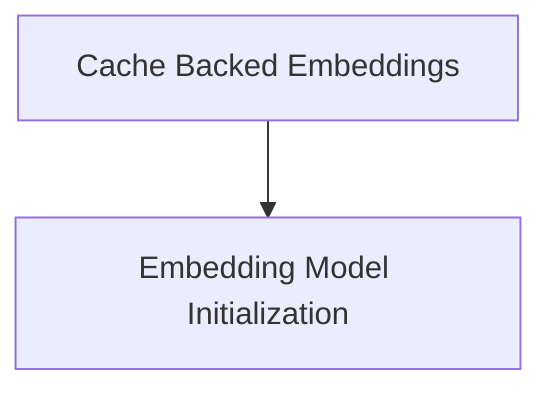

# Classic Embeddings Module

The `classic_embeddings` module provides core functionalities for working with embedding models, including initializing various embedding providers and implementing a caching mechanism to optimize embedding generation.

## Architecture Overview

The `classic_embeddings` module is composed of two main sub-modules:

*   **Embedding Model Initialization** (`embedding_initialization.md`): Handles the dynamic loading and initialization of embedding models from different providers.
*   **Cache Backed Embeddings** (`cache_backed_embeddings.md`): Provides a caching layer to store and retrieve previously computed embeddings, reducing redundant computations and improving performance.

<!-- DIAGRAM_JSON
{
    "direction": "TD",
    "nodes": [
        {"id": "embedding_initialization", "label": "Embedding Model Initialization", "type": "module", "link": "embedding_initialization.md"},
        {"id": "cache_backed_embeddings", "label": "Cache Backed Embeddings", "type": "module", "link": "cache_backed_embeddings.md"}
    ],
    "edges": [
        {"source": "cache_backed_embeddings", "target": "embedding_initialization"}
    ],
    "groups": []
}
-->

## Sub-modules

### [Embedding Model Initialization](embedding_initialization.md)

This sub-module focuses on the `init_embeddings` utility, which allows for the flexible initialization of various embedding models. It supports different providers like OpenAI, Azure AI, Bedrock, Cohere, Google GenAI, Google Vertex AI, HuggingFace, MistralAI, and Ollama, abstracting away the specifics of each integration.

### [Cache Backed Embeddings](cache_backed_embeddings.md)

The `CacheBackedEmbeddings` sub-module provides a robust caching mechanism for embedding operations. It leverages a `BaseStore` to persist embeddings, significantly improving performance by reusing previously computed values. This sub-module also includes serialization and deserialization utilities (`_value_serializer`, `_value_deserializer`) for handling embedding data within the cache.