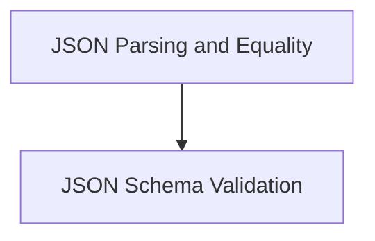

# classic_evaluation_parsing Module Documentation

## Introduction and Purpose

The `classic_evaluation_parsing` module provides a set of tools for evaluating and parsing JSON strings. It includes functionalities to check for JSON validity, compare two JSON structures for equality, and validate JSON against a given schema. This module is crucial for tasks involving structured data validation and comparison within the evaluation framework.

## Architecture Overview

The `classic_evaluation_parsing` module is composed of several sub-modules, each focusing on a specific aspect of JSON parsing and evaluation:

<!-- DIAGRAM_JSON
{
    "direction": "TD",
    "nodes": [
        {"id": "json_parsing_and_equality", "label": "JSON Parsing and Equality", "type": "module", "link": "json_parsing_and_equality.md"},
        {"id": "json_schema_validation", "label": "JSON Schema Validation", "type": "module", "link": "json_schema_validation.md"}
    ],
    "edges": [
        {"source": "json_parsing_and_equality", "target": "json_schema_validation", "label": "utilizes"}
    ],
    "groups": []
}
-->

## Sub-modules

### [JSON Parsing and Equality](json_parsing_and_equality.md)

This sub-module focuses on the fundamental aspects of JSON processing, including validating if a string is a well-formed JSON and determining if two JSON structures are equivalent.

### [JSON Schema Validation](json_schema_validation.md)

This sub-module provides capabilities to validate JSON data against a defined JSON schema, ensuring data integrity and adherence to specified formats. This is particularly useful for robust data ingestion and processing pipelines. 
