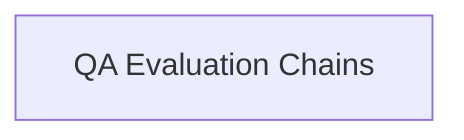

# `classic_evaluation_qa`

The `classic_evaluation_qa` module provides a foundational set of tools and chains for evaluating Question Answering (QA) systems within the LangChain Classic framework. It offers mechanisms to assess the correctness and contextual accuracy of generated answers against reference answers and inputs.

## Architecture

The module is structured around specialized evaluation chains that leverage Language Models (LLMs) to perform assessments. It integrates with prompts to guide the evaluation process and can be extended for various QA evaluation scenarios, including standard correctness checks and more complex Chain-of-Thought (CoT) reasoning evaluations.

<!-- DIAGRAM_JSON
{
    "direction": "TD",
    "nodes": [
        {"id": "qa_evaluation_chains", "label": "QA Evaluation Chains", "type": "module", "link": "qa_evaluation_chains.md"}
    ],
    "edges": []
}
-->

## Sub-modules

### `qa_evaluation_chains`

The [QA Evaluation Chains](qa_evaluation_chains.md) sub-module contains the core logic for constructing and running QA evaluation workflows. It includes implementations for standard question-answering evaluation and Chain-of-Thought based evaluations, allowing for flexible assessment of LLM responses.