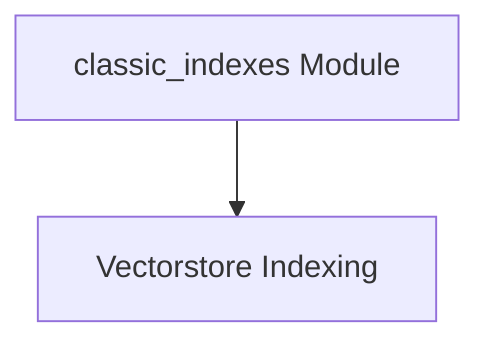

# classic_indexes Module Documentation

## Introduction

The `classic_indexes` module provides foundational tools for creating and managing vector store indexes within the LangChain Classic framework. It facilitates the process of transforming raw documents into a searchable, vector-based format, enabling efficient information retrieval and semantic search capabilities. This module is crucial for applications that require intelligent document handling and similarity-based querying.

## Architecture Overview

The `classic_indexes` module is structured around the core concept of vector store indexing. Its primary sub-module, `vectorstore_indexing`, encapsulates the logic for loading documents, splitting them into manageable chunks, embedding these chunks into vector representations, and storing them in a chosen vector store. It integrates with other LangChain components like `BaseLoader` for document ingestion, `Embeddings` for vector conversion, and `TextSplitter` for document chunking.

<!-- DIAGRAM_JSON
{
    "direction": "TD",
    "nodes": [
        {"id": "vectorstore_indexing", "label": "Vectorstore Indexing", "type": "module", "link": "vectorstore_indexing.md"}
    ],
    "edges": [],
    "groups": []
}
-->

## Sub-modules

### [Vectorstore Indexing](vectorstore_indexing.md)
This sub-module handles the core logic for creating, populating, and managing vector store indexes from documents or document loaders, including text splitting and embedding.