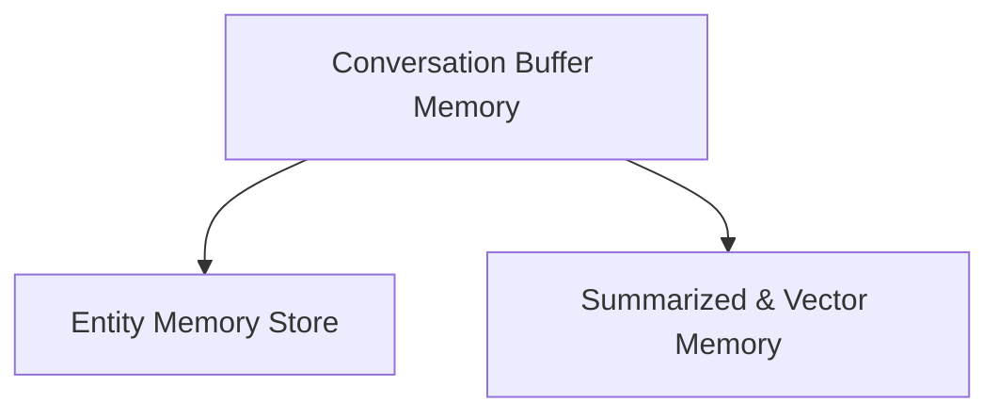

# classic_memory Module Documentation

## Introduction

The `classic_memory` module provides a suite of conversation memory implementations designed for various use cases within language model applications. These implementations range from simple buffer-based storage to more advanced entity-aware and summarized memory solutions, catering to different requirements for maintaining conversational context.

## Architecture Overview

The `classic_memory` module is structured into several sub-modules, each focusing on a specific aspect of conversation memory management. At its core, it leverages a base chat memory interface, extended by specialized implementations for buffering, entity tracking, and summarization, including external storage integrations like Redis and SQLite.

<!-- DIAGRAM_JSON
{
    "direction": "TD",
    "nodes": [
        {"id": "buffer_memory", "label": "Conversation Buffer Memory", "type": "module", "link": "buffer_memory.md"},
        {"id": "entity_memory_store", "label": "Entity Memory Store", "type": "module", "link": "entity_memory_store.md"},
        {"id": "summary_and_vector_memory", "label": "Summarized & Vector Memory", "type": "module", "link": "summary_and_vector_memory.md"}
    ],
    "edges": [
        {"source": "buffer_memory", "target": "entity_memory_store"},
        {"source": "buffer_memory", "target": "summary_and_vector_memory"}
    ],
    "groups": []
}
-->

## Sub-modules

### [Conversation Buffer Memory](buffer_memory.md)
This sub-module provides fundamental conversation memory functionalities, including basic storage of chat messages (ConversationBufferMemory, ConversationStringBufferMemory) and maintaining a fixed-size window of recent conversation turns (ConversationBufferWindowMemory). It also defines the base interface for chat memory (`BaseChatMemory`).

### [Entity Memory Store](entity_memory_store.md)
This sub-module focuses on advanced memory capabilities that involve extracting and summarizing named entities from conversations. It includes `ConversationEntityMemory` for entity management and various storage implementations like `InMemoryEntityStore`, `RedisEntityStore`, `UpstashRedisEntityStore`, and `SQLiteEntityStore` for persisting entity data.

### [Summarized & Vector Memory](summary_and_vector_memory.md)
This sub-module offers memory types that provide a concise summary of the conversation history while also managing the total token count. It includes `ConversationSummaryMemory` for continuous summarization, `ConversationSummaryBufferMemory` for a summarized buffer with a token limit, and `ConversationVectorStoreTokenBufferMemory` for vector store-backed token buffering to retrieve relevant past interactions.
