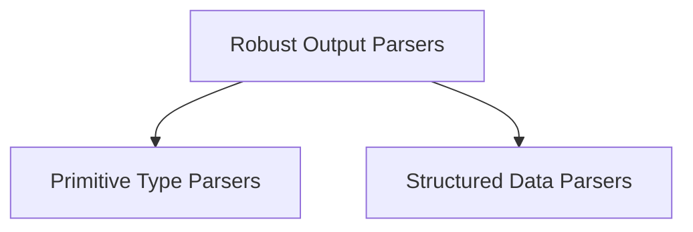

# `classic_output_parsers` Module Documentation

## Introduction

The `classic_output_parsers` module provides a collection of tools for parsing the raw string outputs from Large Language Models (LLMs) into more structured and usable formats. This is crucial for integrating LLM responses into applications, ensuring that the output conforms to expected data types, structures, or schema.

## Architecture Overview

The module is organized into several sub-modules, each focusing on a specific parsing strategy or target format. This modular design allows for flexible integration and extension of parsing capabilities.

<!-- DIAGRAM_JSON
{
    "direction": "TD",
    "nodes": [
        {"id": "primitive_type_parsers", "label": "Primitive Type Parsers", "type": "module", "link": "primitive_type_parsers.md"},
        {"id": "structured_data_parsers", "label": "Structured Data Parsers", "type": "module", "link": "structured_data_parsers.md"},
        {"id": "robust_parsers", "label": "Robust Output Parsers", "type": "module", "link": "robust_parsers.md"}
    ],
    "edges": [
        {"source": "robust_parsers", "target": "primitive_type_parsers"},
        {"source": "robust_parsers", "target": "structured_data_parsers"}
    ],
    "groups": []
}
-->

## Sub-modules

### [Primitive Type Parsers](primitive_type_parsers.md)
Parsers for converting LLM outputs into basic data types such as datetime objects and enum values.

### [Structured Data Parsers](structured_data_parsers.md)
Parsers designed for converting LLM responses into complex data structures like dictionaries (JSON), YAML, and Pandas DataFrames.

### [Robust Output Parsers](robust_parsers.md)
Parsers equipped with error-handling and retry mechanisms to improve the reliability of LLM output parsing, often involving an LLM to fix errors.
