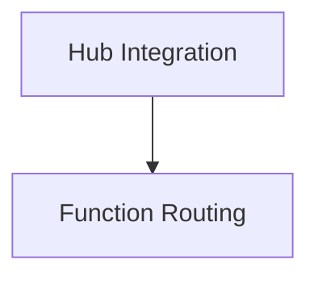

# `classic_runnables` Module Documentation

## Introduction

The `classic_runnables` module in LangChain provides fundamental building blocks for creating and orchestrating executable components, known as "runnables." It offers abstractions for defining how these components process inputs, produce outputs, and integrate with various services and routing mechanisms.

## Architecture Overview

This module is structured around two key areas: integrating runnables from the LangChain Hub and enabling dynamic routing based on AI function calls. The following diagram illustrates the relationship between these core functionalities:

<!-- DIAGRAM_JSON
{
    "direction": "TD",
    "nodes": [
        {"id": "hub_integration", "label": "Hub Integration", "type": "module", "link": "hub_integration.md"},
        {"id": "function_routing", "label": "Function Routing", "type": "module", "link": "function_routing.md"}
    ],
    "edges": [
        {"source": "hub_integration", "target": "function_routing", "label": "can integrate with"}
    ],
    "groups": []
}
-->

## Sub-modules and Core Functionality

### [Hub Integration](hub_integration.md)

This sub-module focuses on the integration with the LangChain Hub, allowing developers to easily pull and incorporate pre-defined or shared runnables into their applications. It simplifies the process of utilizing community-contributed or centrally managed runnable components.

### [Function Routing](function_routing.md)

The `function_routing` sub-module provides capabilities for intelligent routing of inputs to different runnables. Specifically, it enables the system to interpret AI model (e.g., OpenAI functions) outputs and dynamically direct the flow of execution to the appropriate runnable based on the detected function call.
