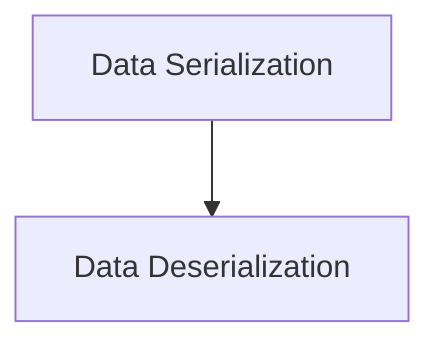

# Classic Storage Module

The `classic_storage` module provides core functionalities for serializing and deserializing data within the LangChain Classic framework. It is responsible for converting various objects, particularly `Document` instances, into a byte representation for efficient storage and retrieval, and vice-versa.

## Architecture Overview

The `classic_storage` module is composed of two main sub-modules: `data_serialization` and `data_deserialization`. These sub-modules work in tandem to ensure seamless conversion of data types for persistence.

<!-- DIAGRAM_JSON
{
    "direction": "TD",
    "nodes": [
        {"id": "data_serialization", "label": "Data Serialization", "type": "module", "link": "data_serialization.md"},
        {"id": "data_deserialization", "label": "Data Deserialization", "type": "module", "link": "data_deserialization.md"}
    ],
    "edges": [
        {"source": "data_serialization", "target": "data_deserialization"}
    ],
    "groups": []
}
-->

## Sub-modules

### [Data Serialization](data_serialization.md)
This sub-module focuses on converting Python objects, especially `Document` instances, into a byte format suitable for storage. It includes functions for robust and consistent serialization.

### [Data Deserialization](data_deserialization.md)
This sub-module handles the reverse process, taking byte representations and reconstructing them back into their original Python object forms, with specific emphasis on `Document` objects. It includes error handling for type validation during deserialization.
