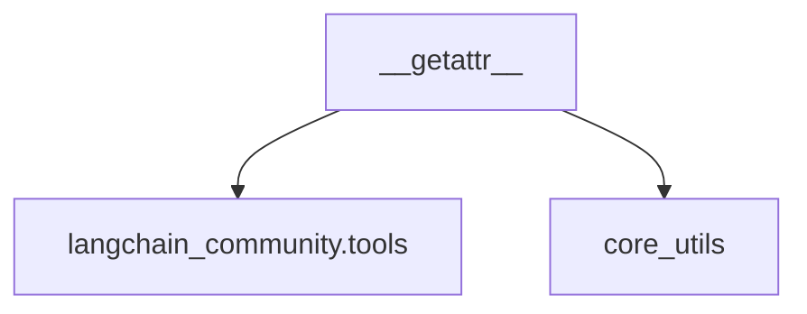

# classic_tools Module Documentation

## Introduction

The `classic_tools` module serves as a compatibility layer for tools that were previously part of the main `langchain` package but have since been moved to `langchain_community`. Its primary function is to provide a seamless transition for existing codebases by dynamically importing these tools from `langchain_community` while issuing deprecation warnings to encourage migration to the new import paths.

This module ensures that applications relying on the older `langchain.tools` imports continue to function, albeit with a warning, guiding developers towards the recommended `langchain_community.tools` module for future development.

## Architecture and Component Relationships

The `classic_tools` module is a leaf module, meaning it does not contain any sub-modules. Its core functionality revolves around a single dynamic import mechanism.

### Core Components

#### `__getattr__`

This special method is the heart of the `classic_tools` module. When an attribute (a tool) is accessed from `classic_tools` (e.g., `from langchain.tools import PythonREPLTool`), `__getattr__` intercepts the request.

It first checks for specific tools like `PythonAstREPLTool` and `PythonREPLTool`, which are handled by internal import functions (though the provided code snippet only shows their calls, implying they exist elsewhere or are dynamically generated). For all other tools, it attempts to import them from `langchain_community.tools`.

Crucially, if the environment is not interactive, `__getattr__` issues a `LangChainDeprecationWarning`, informing the developer about the deprecated import path and suggesting the correct `langchain_community` import.

### Dependencies

- **`langchain_community.tools`**: This is the primary external dependency. The `classic_tools` module delegates the actual tool loading to this module, providing backward compatibility.
- **`core_utils`**: Specifically, the `is_interactive_env()` function from `core_utils` is used to determine whether a deprecation warning should be issued. This prevents warnings from cluttering interactive sessions unnecessarily.

<!-- DIAGRAM_JSON
{
    "direction": "TD",
    "nodes": [
        {"id": "getattr_func", "label": "__getattr__", "type": "component", "link": null},
        {"id": "langchain_community_tools", "label": "langchain_community.tools", "type": "external", "link": null},
        {"id": "core_utils", "label": "core_utils", "type": "external", "link": "core_utils.md"}
    ],
    "edges": [
        {"source": "getattr_func", "target": "langchain_community_tools"},
        {"source": "getattr_func", "target": "core_utils"}
    ],
    "groups": []
}
-->
