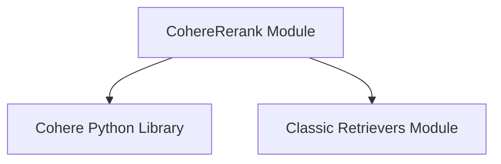

# Cohere Reranker Module

The `cohere_reranker` module provides a document compressor that leverages the Cohere Rerank API to reorder and filter documents based on their relevance to a given query. This module is a specialized component within the broader `classic_retrievers` ecosystem, designed to enhance the quality of retrieved documents by applying advanced reranking capabilities.

## Architecture and Core Components

The `cohere_reranker` module is centered around a single core component: `CohereRerank`.

### `CohereRerank` Class

The `CohereRerank` class is an implementation of the `BaseDocumentCompressor` interface, which is defined in the [classic_retrievers](classic_retrievers.md) module. Its primary function is to interact with the Cohere Rerank API to intelligently re-rank a collection of documents based on a user's query, effectively bringing the most relevant documents to the forefront.

**Key Features:**

*   **Cohere API Integration**: Seamlessly integrates with the Cohere Rerank API for state-of-the-art document reranking.
*   **Configurable Reranking**: Allows customization of the Cohere model to be used for reranking and the number of top relevant documents to return.
*   **Environment Validation**: Automatically validates the presence of the `cohere` Python package and the Cohere API key during initialization, ensuring a smooth setup process.
*   **Document Compression**: Implements the `compress_documents` method to process a sequence of `Document` objects, add a `relevance_score` to their metadata, and return the re-ranked sequence.

**Attributes:**

*   `client`: An instance of the Cohere client used for API calls.
*   `top_n`: An integer specifying the maximum number of documents to return after reranking (default is 3). If set to `None` or a non-positive value, all results are returned.
*   `model`: A string indicating the Cohere model to use for reranking (default is "rerank-english-v2.0").
*   `cohere_api_key`: The API key for authenticating with the Cohere service. Can be set directly or via the `COHERE_API_KEY` environment variable.
*   `user_agent`: A string identifier for the application making the request to Cohere.

**Methods:**

*   `validate_environment(cls, values: dict) -> Any`: A class method that verifies the `cohere` package is installed and the `cohere_api_key` is available. It initializes the `cohere.Client` if not already provided.
*   `rerank(self, documents: Sequence[str | Document | dict], query: str, *, model: str | None = None, top_n: int | None = -1, max_chunks_per_doc: int | None = None) -> list[dict[str, Any]]`: This method sends the provided documents and query to the Cohere Rerank API. It returns a list of dictionaries, each containing the original document's index and its calculated `relevance_score`.
*   `compress_documents(self, documents: Sequence[Document], query: str, callbacks: Callbacks | None = None) -> Sequence[Document]`: Overrides the base compressor method. It takes a list of `Document` objects, applies the Cohere reranking, and returns a new sequence of `Document` objects, each enriched with a `relevance_score` in its metadata.

## Module Relationships

The `cohere_reranker` module depends on the `cohere` Python library for its core functionality. It also integrates with the `classic_retrievers` module by implementing the `BaseDocumentCompressor` interface, making it a specialized component within the document compression framework.

<!-- DIAGRAM_JSON
{
    "direction": "TD",
    "nodes": [
        {"id": "cohere_reranker_module", "label": "CohereRerank Module", "type": "component", "link": null},
        {"id": "cohere_library", "label": "Cohere Python Library", "type": "external", "link": null},
        {"id": "classic_retrievers", "label": "Classic Retrievers Module", "type": "external", "link": "classic_retrievers.md"}
    ],
    "edges": [
        {"source": "cohere_reranker_module", "target": "cohere_library"},
        {"source": "cohere_reranker_module", "target": "classic_retrievers"}
    ],
    "groups": []
}
-->

