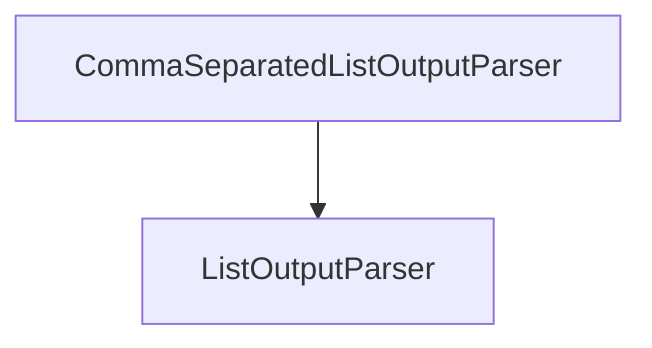

# comma_separated_list_parser

## Introduction

The `comma_separated_list_parser` module provides a specialized output parser for converting a model's string output into a list of strings, based on comma separation. This module is particularly useful when the expected output from a language model is a simple list of items.

## Module Architecture and Component Relationships

This module contains a single core component, `CommaSeparatedListOutputParser`, which extends the functionality of `ListOutputParser` found in the `base_output_parsers` module. It defines how to parse a comma-separated string, including handling quoted items and spaces.

<!-- DIAGRAM_JSON
{
    "direction": "TD",
    "nodes": [
        {"id": "comma_separated_list_output_parser", "label": "CommaSeparatedListOutputParser", "type": "component", "link": null},
        {"id": "list_output_parser", "label": "ListOutputParser", "type": "external", "link": "base_output_parsers.md"}
    ],
    "edges": [
        {"source": "comma_separated_list_output_parser", "target": "list_output_parser"}
    ],
    "groups": []
}
-->

## Core Components

### CommaSeparatedListOutputParser

`CommaSeparatedListOutputParser` is an output parser designed to take a string generated by a language model and parse it into a Python list of strings. It is particularly robust, utilizing `csv.reader` to correctly handle various comma-separated formats, including those with quoted elements.

**Key Features:**

*   **Inheritance**: Inherits from `ListOutputParser`, providing a common interface for list-based parsers.
*   **Serialization**: Fully serializable within the LangChain ecosystem.
*   **Format Instructions**: Provides clear instructions to the language model on how to format its output as a comma-separated list.
*   **Robust Parsing**: Employs Python's `csv` module for accurate parsing of comma-separated values, including cases with spaces after commas or quoted values. Includes a fallback to simple string splitting.

**Methods:**

*   `is_lc_serializable() -> bool`:
    Returns `True` indicating the class is serializable.

*   `get_lc_namespace() -> list[str]`:
    Returns the namespace `["langchain", "output_parsers", "list"]` for LangChain's serialization.

*   `get_format_instructions() -> str`:
    Returns a string guiding the model to produce comma-separated output, e.g., `"foo, bar, baz"`.

*   `parse(text: str) -> list[str]`:
    The core method that takes the raw text output from an LLM and converts it into a list of strings. It first attempts to use `csv.reader` for parsing. If a `csv.Error` occurs, it falls back to a simpler `text.split(",")` approach.

*   `_type` property `-> str`:
    Returns the string `"comma-separated-list"` to identify the parser type.