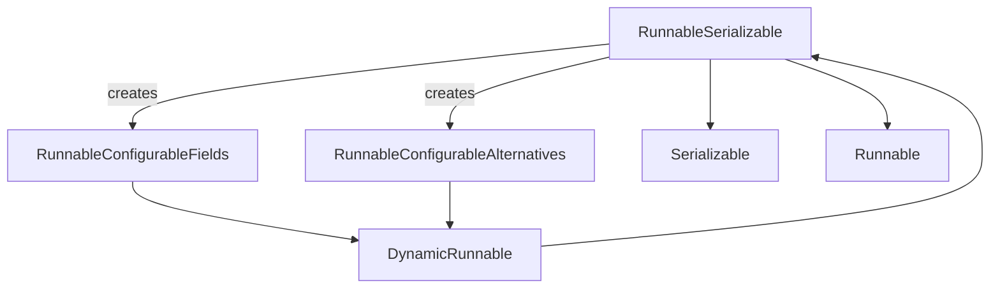
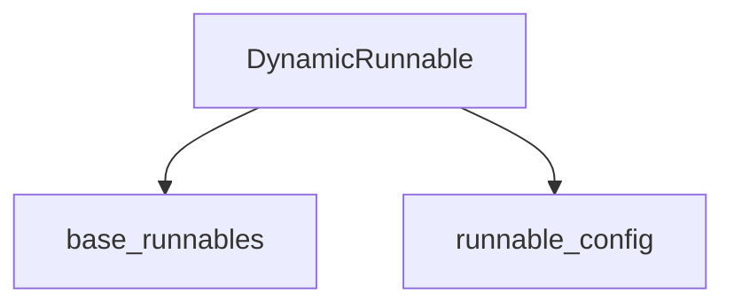

# `configurable_runnables`

## Introduction

The `configurable_runnables` module provides powerful mechanisms for dynamically configuring `Runnable` objects within the LangChain ecosystem. This module enables developers to create flexible and adaptable applications where the behavior of `Runnable` components can be altered at runtime, either by adjusting specific parameters or by swapping out entire implementations. This significantly enhances the reusability and extensibility of LangChain applications.

## Core Functionality

This module introduces key classes that facilitate dynamic configuration: `DynamicRunnable`, `RunnableConfigurableFields`, and `RunnableConfigurableAlternatives`. These classes work in conjunction with `RunnableSerializable` (from [`base_runnables`](base_runnables.md)) to offer robust configurability.

### `RunnableSerializable`

The `RunnableSerializable` class, defined in the `base_runnables` module, serves as the foundation for all configurable runnables. It extends the base `Runnable` class with serialization capabilities and introduces the primary methods for dynamic configuration:

*   **`configurable_fields(**kwargs: AnyConfigurableField)`**: This method allows individual fields of a `Runnable` to be configured at runtime. It returns a `RunnableConfigurableFields` instance, which manages the dynamic overriding of these fields. This is particularly useful for adjusting parameters like model temperature, token limits, or prompt templates without altering the underlying code.

    ```python
    from langchain_core.runnables import ConfigurableField
    from langchain_openai import ChatOpenAI

    model = ChatOpenAI(max_tokens=20).configurable_fields(
        max_tokens=ConfigurableField(
            id="output_token_number",
            name="Max tokens in the output",
            description="The maximum number of tokens in the output",
        )
    )

    # max_tokens = 20
    print(
        "max_tokens_20: ", model.invoke("tell me something about chess").content
    )

    # max_tokens = 200
    print(
        "max_tokens_200: ",
        model.with_config(configurable={"output_token_number": 200})
        .invoke("tell me something about chess")
        .content,
    )
    ```

*   **`configurable_alternatives(which: ConfigurableField, *, default_key: str = "default", prefix_keys: bool = False, **kwargs: Runnable[Input, Output] | Callable[[], Runnable[Input, Output]])`**: This method enables the selection of different `Runnable` implementations at runtime. It takes a `ConfigurableField` to determine the active alternative and a dictionary of possible `Runnable` alternatives. It returns a `RunnableConfigurableAlternatives` instance. This is ideal for scenarios where you need to switch between different LLMs, retrieval strategies, or prompt variations based on user input or environmental conditions.

    ```python
    from langchain_anthropic import ChatAnthropic
    from langchain_core.runnables.utils import ConfigurableField
    from langchain_openai import ChatOpenAI

    model = ChatAnthropic(
        model_name="claude-sonnet-4-5-20250929"
    ).configurable_alternatives(
        ConfigurableField(id="llm"),
        default_key="anthropic",
        openai=ChatOpenAI(),
    )

    # uses the default model ChatAnthropic
    print(model.invoke("which organization created you?").content)

    # uses ChatOpenAI
    print(
        model.with_config(configurable={"llm": "openai"})
        .invoke("which organization created you?")
        .content
    )
    ```

### `DynamicRunnable`

`DynamicRunnable` is an abstract base class that inherits from `RunnableSerializable`. It acts as a wrapper around a `default` `RunnableSerializable` instance and its configuration. Its primary role is to provide the infrastructure for resolving the correct `Runnable` and configuration at invocation time, handling the dynamic aspects introduced by `configurable_fields` and `configurable_alternatives`.

Key characteristics:
*   **`default`**: The base `RunnableSerializable` instance that `DynamicRunnable` wraps.
*   **`config`**: The runtime configuration applied to the `DynamicRunnable`.
*   **`prepare()`**: A crucial method that recursively resolves the actual `Runnable` to be invoked and its final configuration, traversing any nested `DynamicRunnable` instances.

### `RunnableConfigurableFields`

This class extends `DynamicRunnable` and is specifically designed to manage runtime configuration of individual fields. It is instantiated by the `configurable_fields` method of `RunnableSerializable`.

*   **`fields`**: A dictionary mapping field names to `AnyConfigurableField` instances, specifying which fields can be configured.
*   **`_prepare()`**: When invoked, this method examines the `configurable` part of the incoming `config`. If a configurable field matches one in its `fields` dictionary, it creates a new instance of the `default` `Runnable` with the specified field overridden, effectively applying the dynamic configuration.

### `RunnableConfigurableAlternatives`

This class also extends `DynamicRunnable` and is responsible for managing runtime selection of alternative `Runnable` implementations. It can be instantiated directly or through the `configurable_alternatives` method of `RunnableSerializable`.

*   **`which`**: A `ConfigurableField` that determines which alternative `Runnable` to select from the `alternatives` dictionary.
*   **`alternatives`**: A dictionary where keys are identifiers and values are `Runnable` instances or callables that return `Runnable` instances.
*   **`default_key`**: The key for the default alternative to use if no specific alternative is selected in the configuration.
*   **`_prepare()`**: This method retrieves the `which` configurable value from the incoming `config`. Based on this value, it returns the corresponding `Runnable` from the `alternatives` dictionary or the `default` `Runnable`.

## Architecture and Component Relationships

The `configurable_runnables` module integrates seamlessly with the broader `core_runnables` architecture. `RunnableSerializable` forms the base, enabling both serialization and dynamic configuration. `DynamicRunnable` acts as an intermediary, abstracting the mechanism of resolving dynamically configured runnables. `RunnableConfigurableFields` and `RunnableConfigurableAlternatives` are concrete implementations of `DynamicRunnable`, providing specific strategies for field-level and alternative-selection configurability.

This design promotes a layered approach, where core `Runnable` logic remains clean, and configurability is injected through specialized wrappers.

<!-- DIAGRAM_JSON
{
    "direction": "TD",
    "nodes": [
        {"id": "runnable_serializable", "label": "RunnableSerializable", "type": "component", "link": "base_runnables.md"},
        {"id": "dynamic_runnable", "label": "DynamicRunnable", "type": "component", "link": null},
        {"id": "configurable_fields", "label": "RunnableConfigurableFields", "type": "component", "link": null},
        {"id": "configurable_alternatives", "label": "RunnableConfigurableAlternatives", "type": "component", "link": null},
        {"id": "serializable", "label": "Serializable", "type": "external", "link": "core_load.md"},
        {"id": "runnable", "label": "Runnable", "type": "external", "link": "base_runnables.md"}
    ],
    "edges": [
        {"source": "runnable_serializable", "target": "serializable"},
        {"source": "runnable_serializable", "target": "runnable"},
        {"source": "dynamic_runnable", "target": "runnable_serializable"},
        {"source": "configurable_fields", "target": "dynamic_runnable"},
        {"source": "configurable_alternatives", "target": "dynamic_runnable"},
        {"source": "runnable_serializable", "target": "configurable_fields", "label": "creates"},
        {"source": "runnable_serializable", "target": "configurable_alternatives", "label": "creates"}
    ],
    "groups": []
}
-->


## How the Module Fits into the Overall System

The `configurable_runnables` module is a crucial part of building highly adaptable and maintainable LangChain applications. By allowing runtime configuration of `Runnable` objects, it promotes:

*   **Flexibility**: Developers can easily adjust the behavior of components without code changes, facilitating experimentation and rapid iteration.
*   **Reusability**: `Runnable` components can be designed to be generic and then configured for specific use cases, reducing duplication.
*   **Extensibility**: New configurations or alternative implementations can be introduced without modifying core logic.
*   **A/B Testing and Optimization**: Different configurations can be tested and optimized in production environments.

This module is fundamental for creating sophisticated LangChain agents, chains, and other AI applications that require dynamic behavior and easy customization based on different contexts or user preferences. It provides the building blocks for creating robust and intelligent systems that can respond to changing requirements effectively.


## Introduction

The `configurable_runnables` module provides the `DynamicRunnable` class, which enables the creation of runnables whose behavior can be dynamically altered based on configuration. This is crucial for building flexible and adaptable AI applications that can change their execution paths or component implementations without requiring code modifications.

## Architecture and Core Components

The `configurable_runnables` module's primary component is the `DynamicRunnable`.

### DynamicRunnable

`DynamicRunnable` is a serializable `Runnable` that acts as a wrapper around another `Runnable` (the `default`) and allows its behavior to be overridden or modified through configuration. It is designed to be initiated via the `configurable_fields` or `configurable_alternatives` methods of a `Runnable` (methods not shown in the provided code, but implied by the docstring).

**Key Features and Functionality:**

*   **Dynamic Configuration:** The core idea is to allow the underlying runnable to be swapped or configured at runtime based on the `RunnableConfig` provided during invocation or via `with_config`.
*   **Default Runnable:** It holds a `default` runnable, which is used if no dynamic configuration overrides are specified.
*   **Serialization:** As a `RunnableSerializable`, it can be serialized and deserialized, making it suitable for persistence and distributed systems.
*   **Method Proxying:** `DynamicRunnable` intelligently proxies calls to its underlying runnable's methods (`invoke`, `ainvoke`, `batch`, `abatch`, `stream`, `astream`, `transform`, `atransform`, `get_input_schema`, `get_output_schema`, `get_graph`). Before executing these methods, it `prepares` the effective runnable and configuration based on any dynamic overrides.
*   **`prepare` Method:** This internal method is responsible for resolving the actual runnable to be executed and its corresponding configuration, potentially recursing through multiple layers of `DynamicRunnable`s.
*   **Config Merging:** It handles the merging of configurations, allowing for hierarchical and additive configuration adjustments.

**How it Fits into the Overall System:**

`DynamicRunnable` plays a vital role in the LangChain Core ecosystem by providing a mechanism for creating highly configurable and flexible chains and agents. It allows developers to define a base workflow (`default` runnable) and then introduce points of variability that can be controlled externally. This promotes:

*   **Modularity:** Different implementations of a step can be swapped in and out.
*   **Experimentation:** Easily switch between different models, tools, or logic for A/B testing or rapid prototyping.
*   **Production Readiness:** Configure behaviors for different environments (e.g., development vs. production) without code changes.

It depends on the base `Runnable` and `RunnableSerializable` interfaces defined in the [base_runnables module](base_runnables.md) and utilizes `RunnableConfig` from the [runnable_config module](runnable_config.md) for its dynamic behavior.

## Architecture Diagram

<!-- DIAGRAM_JSON
{
    "direction": "TD",
    "nodes": [
        {"id": "dynamic_runnable", "label": "DynamicRunnable", "type": "component", "link": null},
        {"id": "base_runnables", "label": "base_runnables", "type": "external", "link": "base_runnables.md"},
        {"id": "runnable_config", "label": "runnable_config", "type": "external", "link": "runnable_config.md"}
    ],
    "edges": [
        {"source": "dynamic_runnable", "target": "base_runnables"},
        {"source": "dynamic_runnable", "target": "runnable_config"}
    ],
    "groups": []
}
-->
