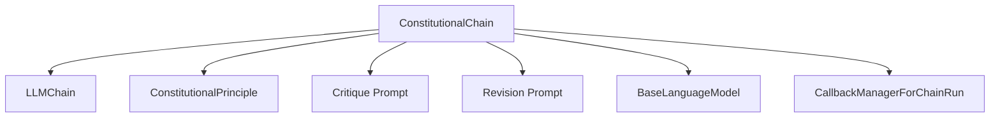

# Constitutional AI Chain

**Module:** `constitutional_ai_chain`

The `constitutional_ai_chain` module provides a mechanism for applying constitutional principles to AI responses, allowing for self-correction and alignment with specified guidelines. This module's core component, `ConstitutionalChain`, orchestrates a process of critiquing an initial AI-generated response against predefined principles and then revising the response based on those critiques.

***

## Deprecation Notice

It is important to note that the `ConstitutionalChain` class is **deprecated**. A more robust and flexible replacement implementation using [LangGraph](https://langchain-langgraph.readthedocs.io/en/latest/) is recommended. The LangGraph-based approach offers:

*   Integration with LLM tool calling features, avoiding string parsing.
*   Support for both token-by-token and step-by-step streaming.
*   Checkpointing and memory for chat history.
*   Easier modification and extension with additional tools or structured responses.

Developers are strongly encouraged to migrate to the LangGraph implementation for new projects and consider refactoring existing implementations.

***

## Architecture and Component Relationships

The `constitutional_ai_chain` module revolves around the `ConstitutionalChain` class, which acts as the primary orchestrator. It depends on several external components for its operation, including a base `LLMChain` for initial response generation, and dedicated `LLMChain` instances for critiquing and revising responses.

<!-- DIAGRAM_JSON
{
    "direction": "TD",
    "nodes": [
        {"id": "constitutional_chain", "label": "ConstitutionalChain", "type": "component", "link": null},
        {"id": "llm_chain", "label": "LLMChain", "type": "external", "link": "classic_chains_base.md"},
        {"id": "constitutional_principle", "label": "ConstitutionalPrinciple", "type": "component", "link": null},
        {"id": "critique_prompt", "label": "Critique Prompt", "type": "component", "link": null},
        {"id": "revision_prompt", "label": "Revision Prompt", "type": "component", "link": null},
        {"id": "base_language_model", "label": "BaseLanguageModel", "type": "external", "link": "core_language_models.md"},
        {"id": "callback_manager_for_chain_run", "label": "CallbackManagerForChainRun", "type": "external", "link": "core_callbacks.md"}
    ],
    "edges": [
        {"source": "constitutional_chain", "target": "llm_chain"},
        {"source": "constitutional_chain", "target": "constitutional_principle"},
        {"source": "constitutional_chain", "target": "critique_prompt"},
        {"source": "constitutional_chain", "target": "revision_prompt"},
        {"source": "constitutional_chain", "target": "base_language_model"},
        {"source": "constitutional_chain", "target": "callback_manager_for_chain_run"}
    ],
    "groups": []
}
-->

### Core Components

*   **`ConstitutionalChain`**
    *   **Purpose:** The main class responsible for applying constitutional principles to refine AI-generated responses. It takes an initial `LLMChain`, a list of `ConstitutionalPrinciple` objects, and dedicated `LLMChain` instances for critiquing and revising responses.
    *   **Functionality:**
        1.  Executes an initial `LLMChain` to generate a base response.
        2.  Iterates through each `ConstitutionalPrinciple`:
            *   Uses a `critique_chain` (an `LLMChain`) to evaluate the current response against the principle's `critique_request`.
            *   If a critique is needed, it uses a `revision_chain` (another `LLMChain`) to revise the response based on the critique and the principle's `revision_request`.
        3.  Returns the final, refined response, optionally including intermediate critiques and revisions.
    *   **`from_llm` Class Method:** A factory method to conveniently create a `ConstitutionalChain` instance by providing an `llm` (which should be a `BaseLanguageModel`), the base `chain`, and optional custom critique and revision prompts.
    *   **Input/Output Keys:** Defines `input_keys` based on the wrapped `chain` and `output_keys` to return the final `output`, and optionally `initial_output` and `critiques_and_revisions`.

*   **`ConstitutionalPrinciple`**
    *   **Purpose:** A data model (implied by its usage in the code, typically a Pydantic model) that defines a single constitutional principle. Each principle includes a `critique_request` (how to evaluate the response) and a `revision_request` (how to improve the response if needed).

*   **`Critique Prompt` and `Revision Prompt`**
    *   **Purpose:** These are `BasePromptTemplate` instances (`CRITIQUE_PROMPT` and `REVISION_PROMPT`) used by the `critique_chain` and `revision_chain` respectively. They define the structure and instructions for the language model to perform the critiquing and revision tasks.

### External Dependencies

*   **`LLMChain`**: (Refer to [classic_chains_base.md](classic_chains_base.md))
    *   The `ConstitutionalChain` wraps an initial `LLMChain` and uses separate `LLMChain` instances for the critique and revision steps. These chains handle the interaction with the underlying language models.

*   **`BaseLanguageModel`**: (Refer to [core_language_models.md](core_language_models.md))
    *   Represents the underlying language model used by the `LLMChain` instances for generating responses, critiques, and revisions.

*   **`CallbackManagerForChainRun`**: (Refer to [core_callbacks.md](core_callbacks.md))
    *   Used for managing callbacks during the execution of the chain, allowing for logging, tracing, and custom event handling.

## System Integration

The `constitutional_ai_chain` module, specifically `ConstitutionalChain`, fits into the `classic_chains_specialized` family of chains. It provides a specialized chain for injecting "constitutional AI" principles into an existing `LLMChain`. This allows developers to enforce ethical guidelines, style requirements, or factual accuracy through an iterative self-correction process facilitated by an LLM.

Despite its deprecation, understanding this module is crucial for maintaining or migrating older systems that still utilize it. For new implementations, the recommended LangGraph approach provides a more modern and flexible way to achieve similar constitutional AI functionalities within the broader LangChain ecosystem.