# content_blocks
This module provides a standardized way to translate AI message content from various providers (e.g., Anthropic, Bedrock, Google, Groq, OpenAI) into a common ContentBlock format, handling both full messages and streaming chunks.

<!-- DIAGRAM_JSON
{
  "nodes": [
    {"id": "register_all", "label": "_register_translators"},
    {"id": "anthropic_iter", "label": "anthropic._iter_blocks"},
    {"id": "convert_citation", "label": "_convert_citation_to_v1"},
    {"id": "bedrock_translate", "label": "bedrock.translate_content"},
    {"id": "bedrock_chunk_translate", "label": "bedrock.translate_content_chunk"},
    {"id": "convert_bedrock", "label": "_convert_to_v1_from_bedrock"},
    {"id": "convert_bedrock_chunk", "label": "_convert_to_v1_from_bedrock_chunk"},
    {"id": "bedrock_converse_iter", "label": "bedrock_converse._iter_blocks"},
    {"id": "genai_translate", "label": "google_genai.translate_content"},
    {"id": "genai_chunk_translate", "label": "google_genai.translate_content_chunk"},
    {"id": "convert_genai", "label": "_convert_to_v1_from_genai"},
    {"id": "vertexai_translate", "label": "google_vertexai.translate_content"},
    {"id": "vertexai_chunk_translate", "label": "google_vertexai.translate_content_chunk"},
    {"id": "convert_vertexai", "label": "_convert_to_v1_from_vertexai"},
    {"id": "groq_translate", "label": "groq.translate_content"},
    {"id": "groq_chunk_translate", "label": "groq.translate_content_chunk"},
    {"id": "convert_groq", "label": "_convert_to_v1_from_groq"},
    {"id": "openai_translate", "label": "openai.translate_content"},
    {"id": "convert_openai_v03", "label": "_convert_from_v03_ai_message"},
    {"id": "convert_openai_chat", "label": "_convert_to_v1_from_chat_completions"},
    {"id": "convert_openai_resp", "label": "_convert_to_v1_from_responses"}
  ],
  "edges": [
    {"source": "register_all", "target": "anthropic_iter", "label": "registers"},
    {"source": "register_all", "target": "bedrock_translate", "label": "registers"},
    {"source": "register_all", "target": "bedrock_chunk_translate", "label": "registers"},
    {"source": "register_all", "target": "bedrock_converse_iter", "label": "registers"},
    {"source": "register_all", "target": "genai_translate", "label": "registers"},
    {"source": "register_all", "target": "genai_chunk_translate", "label": "registers"},
    {"source": "register_all", "target": "vertexai_translate", "label": "registers"},
    {"source": "register_all", "target": "vertexai_chunk_translate", "label": "registers"},
    {"source": "register_all", "target": "groq_translate", "label": "registers"},
    {"source": "register_all", "target": "groq_chunk_translate", "label": "registers"},
    {"source": "register_all", "target": "openai_translate", "label": "registers"},
    {"source": "anthropic_iter", "target": "convert_citation", "label": "uses"},
    {"source": "bedrock_translate", "target": "convert_bedrock", "label": "uses"},
    {"source": "bedrock_chunk_translate", "target": "convert_bedrock_chunk", "label": "uses"},
    {"source": "bedrock_converse_iter", "target": "convert_citation", "label": "uses"},
    {"source": "genai_translate", "target": "convert_genai", "label": "uses"},
    {"source": "genai_chunk_translate", "target": "convert_genai", "label": "uses"},
    {"source": "vertexai_translate", "target": "convert_vertexai", "label": "uses"},
    {"source": "vertexai_chunk_translate", "target": "convert_vertexai", "label": "uses"},
    {"source": "groq_translate", "target": "convert_groq", "label": "uses"},
    {"source": "groq_chunk_translate", "target": "convert_groq", "label": "uses"},
    {"source": "openai_translate", "target": "convert_openai_v03", "label": "uses"},
    {"source": "openai_translate", "target": "convert_openai_chat", "label": "uses"},
    {"source": "openai_translate", "target": "convert_openai_resp", "label": "uses"}
  ],
  "groups": [
    {"id": "Core", "label": "Core", "nodes": ["register_all"]},
    {"id": "Anthropic", "label": "Anthropic Translators", "nodes": ["anthropic_iter", "convert_citation"]},
    {"id": "Bedrock", "label": "Bedrock Translators", "nodes": ["bedrock_translate", "bedrock_chunk_translate", "convert_bedrock", "convert_bedrock_chunk"]},
    {"id": "BedrockConverse", "label": "Bedrock Converse Translators", "nodes": ["bedrock_converse_iter"]},
    {"id": "GoogleGenAI", "label": "Google GenAI Translators", "nodes": ["genai_translate", "genai_chunk_translate", "convert_genai"]},
    {"id": "GoogleVertexAI", "label": "Google VertexAI Translators", "nodes": ["vertexai_translate", "vertexai_chunk_translate", "convert_vertexai"]},
    {"id": "Groq", "label": "Groq Translators", "nodes": ["groq_translate", "groq_chunk_translate", "convert_groq"]},
    {"id": "OpenAI", "label": "OpenAI Translators", "nodes": ["openai_translate", "convert_openai_v03", "convert_openai_chat", "convert_openai_resp"]}
  ]
}
-->

```mermaid
flowchart TD
    subgraph Core
        register_all["_register_translators"]
    end

    subgraph Anthropic Translators
        anthropic_iter["anthropic._iter_blocks"]
        convert_citation["_convert_citation_to_v1"]
    end

    subgraph Bedrock Translators
        bedrock_translate["bedrock.translate_content"]
        bedrock_chunk_translate["bedrock.translate_content_chunk"]
        convert_bedrock["_convert_to_v1_from_bedrock"]
        convert_bedrock_chunk["_convert_to_v1_from_bedrock_chunk"]
    end

    subgraph Bedrock Converse Translators
        bedrock_converse_iter["bedrock_converse._iter_blocks"]
    end

    subgraph Google GenAI Translators
        genai_translate["google_genai.translate_content"]
        genai_chunk_translate["google_genai.translate_content_chunk"]
        convert_genai["_convert_to_v1_from_genai"]
    end

    subgraph Google VertexAI Translators
        vertexai_translate["google_vertexai.translate_content"]
        vertexai_chunk_translate["google_vertexai.translate_content_chunk"]
        convert_vertexai["_convert_to_v1_from_vertexai"]
    end

    subgraph Groq Translators
        groq_translate["groq.translate_content"]
        groq_chunk_translate["groq.translate_content_chunk"]
        convert_groq["_convert_to_v1_from_groq"]
    end

    subgraph OpenAI Translators
        openai_translate["openai.translate_content"]
        convert_openai_v03["_convert_from_v03_ai_message"]
        convert_openai_chat["_convert_to_v1_from_chat_completions"]
        convert_openai_resp["_convert_to_v1_from_responses"]
    end

    register_all -- registers --> anthropic_iter
    register_all -- registers --> bedrock_translate
    register_all -- registers --> bedrock_chunk_translate
    register_all -- registers --> bedrock_converse_iter
    register_all -- registers --> genai_translate
    register_all -- registers --> genai_chunk_translate
    register_all -- registers --> vertexai_translate
    register_all -- registers --> vertexai_chunk_translate
    register_all -- registers --> groq_translate
    register_all -- registers --> groq_chunk_translate
    register_all -- registers --> openai_translate

    anthropic_iter -- uses --> convert_citation
    bedrock_translate -- uses --> convert_bedrock
    bedrock_chunk_translate -- uses --> convert_bedrock_chunk
    bedrock_converse_iter -- uses --> convert_citation
    genai_translate -- uses --> convert_genai
    genai_chunk_translate -- uses --> convert_genai
    vertexai_translate -- uses --> convert_vertexai
    vertexai_chunk_translate -- uses --> convert_vertexai
    groq_translate -- uses --> convert_groq
    groq_chunk_translate -- uses --> convert_groq
    openai_translate -- uses --> convert_openai_v03
    openai_translate -- uses --> convert_openai_chat
    openai_translate -- uses --> convert_openai_resp
```
