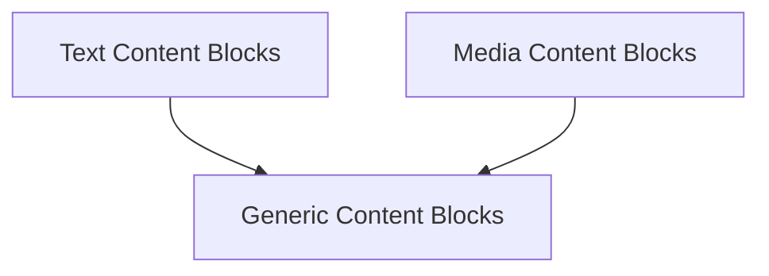

# Content Blocks Module

## Introduction

The `content_blocks` module is a crucial part of the core messaging system, providing a standardized way to construct and represent diverse content within messages. It offers a set of functions to create various types of content blocks, ensuring consistency and ease of use when handling different media and data formats.

## Architecture

The `content_blocks` module is structured into several sub-modules, each focusing on a specific category of content blocks. This modular design enhances maintainability and allows for clear separation of concerns.

<!-- DIAGRAM_JSON
{
    "direction": "TD",
    "nodes": [
        {"id": "text_content_blocks", "label": "Text Content Blocks", "type": "module", "link": "text_content_blocks.md"},
        {"id": "media_content_blocks", "label": "Media Content Blocks", "type": "module", "link": "media_content_blocks.md"},
        {"id": "generic_content_blocks", "label": "Generic Content Blocks", "type": "module", "link": "generic_content_blocks.md"}
    ],
    "edges": [
        {"source": "text_content_blocks", "target": "generic_content_blocks"},
        {"source": "media_content_blocks", "target": "generic_content_blocks"}
    ],
    "groups": []
}
-->

## Sub-modules

This module contains the following sub-modules:

*   ### [Text Content Blocks](text_content_blocks.md)
    This sub-module provides functions for creating various text-based content blocks, including plain text, rich text, and reasoning blocks.

*   ### [Media Content Blocks](media_content_blocks.md)
    This sub-module includes functions for creating content blocks specifically designed for different media types such as images, videos, and audio.

*   ### [Generic Content Blocks](generic_content_blocks.md)
    This sub-module offers functions for creating general-purpose content blocks, encompassing file blocks and non-standard custom blocks.

