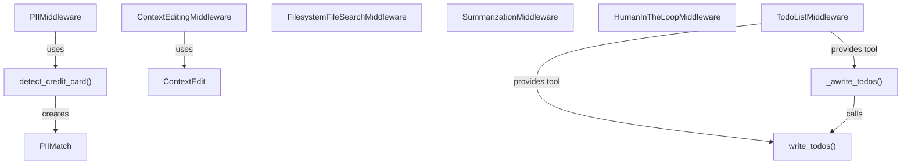

# content_processing_middleware
This module offers various agent middleware components for content processing, including PII detection, context editing, file search, summarization, human approval, and todo list management.

<!-- DIAGRAM_JSON
{
  "nodes": [
    {"id": "PIIMiddleware", "label": "PIIMiddleware", "type": "class"},
    {"id": "detect_credit_card", "label": "detect_credit_card", "type": "function"},
    {"id": "PIIMatch", "label": "PIIMatch", "type": "data_structure"},
    {"id": "ContextEditingMiddleware", "label": "ContextEditingMiddleware", "type": "class"},
    {"id": "ContextEdit", "label": "ContextEdit", "type": "base_class"},
    {"id": "FilesystemFileSearchMiddleware", "label": "FilesystemFileSearchMiddleware", "type": "class"},
    {"id": "SummarizationMiddleware", "label": "SummarizationMiddleware", "type": "class"},
    {"id": "HumanInTheLoopMiddleware", "label": "HumanInTheLoopMiddleware", "type": "class"},
    {"id": "TodoListMiddleware", "label": "TodoListMiddleware", "type": "class"},
    {"id": "write_todos", "label": "write_todos", "type": "function"},
    {"id": "_awrite_todos", "label": "_awrite_todos", "type": "function"}
  ],
  "edges": [
    {"source": "PIIMiddleware", "target": "detect_credit_card", "label": "uses"},
    {"source": "detect_credit_card", "target": "PIIMatch", "label": "creates"},
    {"source": "ContextEditingMiddleware", "target": "ContextEdit", "label": "uses"},
    {"source": "TodoListMiddleware", "target": "write_todos", "label": "provides tool"},
    {"source": "TodoListMiddleware", "target": "_awrite_todos", "label": "provides tool"},
    {"source": "_awrite_todos", "target": "write_todos", "label": "calls"}
  ],
  "groups": []
}
-->
