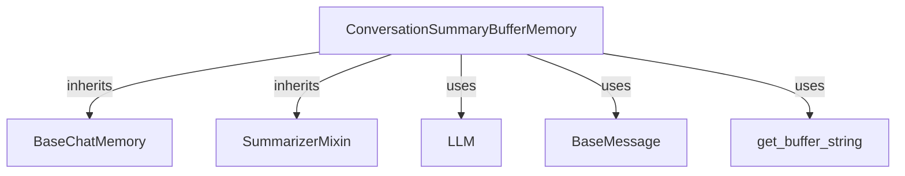

# conversation_summary_buffer_memory Module Documentation

## Introduction
The `conversation_summary_buffer_memory` module provides the `ConversationSummaryBufferMemory` class, an advanced memory management system designed for conversational AI agents. Its primary function is to maintain a coherent and concise history of a conversation while adhering to a strict token limit. It achieves this by intelligently summarizing older parts of the conversation to make room for new messages, ensuring that the most recent and relevant interactions are always available.

## Architecture and Core Components

The `ConversationSummaryBufferMemory` class is a crucial component within the `classic_memory` ecosystem, specifically designed for scenarios where managing conversational context under token constraints is essential. It extends fundamental memory interfaces and leverages language model capabilities for summarization.

### ConversationSummaryBufferMemory

*   **Purpose:** Manages the conversation history by storing both a running summary and the most recent chat messages. It automatically prunes older messages by summarizing them if the total token count exceeds `max_token_limit`.
*   **Key Attributes:**
    *   `max_token_limit`: An integer defining the maximum number of tokens allowed for the conversation buffer.
    *   `moving_summary_buffer`: A string that holds the continuously updated summary of the older, pruned parts of the conversation.
    *   `memory_key`: The key used to store and retrieve the conversation history from the memory variables.
*   **Core Functionality:**
    *   `load_memory_variables(inputs: dict) -> dict`: Retrieves the current conversation history, which includes the `moving_summary_buffer` (if not empty) and the recent `chat_memory.messages`. The output format depends on `return_messages`.
    *   `aload_memory_variables(inputs: dict) -> dict`: Asynchronous version of `load_memory_variables`.
    *   `save_context(inputs: dict, outputs: dict) -> None`: Appends new human and AI messages to the `chat_memory` and then calls `prune()` to enforce the token limit.
    *   `asave_context(inputs: dict, outputs: dict) -> None`: Asynchronous version of `save_context`.
    *   `prune() -> None`: The core logic for managing the token limit. If the current buffer length exceeds `max_token_limit`, it moves older messages from `chat_memory` into a `pruned_memory` list and then uses the underlying LLM to generate a new `moving_summary_buffer` from these pruned messages and the existing summary.
    *   `aprune() -> None`: Asynchronous version of `prune`.
    *   `clear() -> None`: Resets the memory, clearing both the `chat_memory` and `moving_summary_buffer`.
    *   `aclear() -> None`: Asynchronous version of `clear`.
    *   `validate_prompt_input_variables(cls, values: dict) -> dict`: Ensures that the summarization prompt used has the expected input variables (`summary` and `new_lines`).

### Dependencies

*   **[BaseChatMemory](classic_base_memory.md):** `ConversationSummaryBufferMemory` inherits from `BaseChatMemory`, which provides the fundamental interface for managing chat messages.
*   **[SummarizerMixin](classic_memory.md):** This mixin provides the `predict_new_summary` (and `apredict_new_summary`) methods that `ConversationSummaryBufferMemory` uses to generate summaries of pruned messages.
*   **[LLM](core_language_models.md):** The module relies on an underlying Language Model (LLM) to perform token counting (`get_num_tokens_from_messages`) and to generate new summaries of conversational turns.
*   **[BaseMessage](core_messages.md):** Individual chat messages stored and processed by the memory are instances of `BaseMessage` or its subclasses.
*   **`get_buffer_string` (from [classic_memory.md](classic_memory.md) or related utilities):** A utility function used for formatting a list of `BaseMessage` objects into a single string representation of the conversation buffer, particularly when `return_messages` is `False`.

<!-- DIAGRAM_JSON
{
    "direction": "TD",
    "nodes": [
        {"id": "conversation_summary_buffer_memory", "label": "ConversationSummaryBufferMemory", "type": "component", "link": null},
        {"id": "base_chat_memory", "label": "BaseChatMemory", "type": "external", "link": "classic_base_memory.md"},
        {"id": "summarizer_mixin", "label": "SummarizerMixin", "type": "external", "link": "classic_memory.md"},
        {"id": "llm", "label": "LLM", "type": "external", "link": "core_language_models.md"},
        {"id": "base_message", "label": "BaseMessage", "type": "external", "link": "core_messages.md"},
        {"id": "get_buffer_string", "label": "get_buffer_string", "type": "external", "link": "classic_memory.md"}
    ],
    "edges": [
        {"source": "conversation_summary_buffer_memory", "target": "base_chat_memory", "label": "inherits"},
        {"source": "conversation_summary_buffer_memory", "target": "summarizer_mixin", "label": "inherits"},
        {"source": "conversation_summary_buffer_memory", "target": "llm", "label": "uses"},
        {"source": "conversation_summary_buffer_memory", "target": "base_message", "label": "uses"},
        {"source": "conversation_summary_buffer_memory", "target": "get_buffer_string", "label": "uses"}
    ],
    "groups": []
}
-->

## How it Fits into the Overall System

The `conversation_summary_buffer_memory` module is a specialized memory implementation within the `classic_memory` package, located under `summary_and_vector_memory`. It is designed to be integrated into conversational agents and chains that require efficient management of chat history under resource constraints (like token limits for LLMs).

It serves as an intelligent buffer that can be swapped in for simpler memory types when a balance between detailed recent history and a high-level summary of older interactions is needed. By providing both a condensed summary and recent messages, it helps reduce prompt size while retaining crucial context, making it suitable for longer-running conversations or applications with strict API token usage policies. It works in conjunction with various components such as language models for summarization and message utilities for formatting.