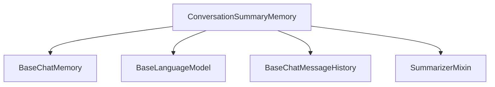

# Conversation Summary Memory Module

## Introduction

The `conversation_summary_memory` module provides a mechanism for continually summarizing conversational history. This module is essential for maintaining context in long-running conversations by distilling past interactions into a concise summary, which can then be used to inform subsequent turns of a language model.

## Architecture and Component Relationships

The `ConversationSummaryMemory` class is the core component of this module. It integrates with several other core components of the system to manage and summarize chat history effectively.

<!-- DIAGRAM_JSON
{
    "direction": "TD",
    "nodes": [
        {"id": "conversation_summary_memory_cls", "label": "ConversationSummaryMemory", "type": "component", "link": null},
        {"id": "base_chat_memory", "label": "BaseChatMemory", "type": "external", "link": "classic_base_memory.md"},
        {"id": "base_language_model", "label": "BaseLanguageModel", "type": "external", "link": "core_language_models.md"},
        {"id": "base_chat_message_history", "label": "BaseChatMessageHistory", "type": "external", "link": "core_chat_history.md"},
        {"id": "summarizer_mixin", "label": "SummarizerMixin", "type": "component", "link": null}
    ],
    "edges": [
        {"source": "conversation_summary_memory_cls", "target": "base_chat_memory"},
        {"source": "conversation_summary_memory_cls", "target": "base_language_model"},
        {"source": "conversation_summary_memory_cls", "target": "base_chat_message_history"},
        {"source": "conversation_summary_memory_cls", "target": "summarizer_mixin"}
    ],
    "groups": []
}
-->

## Core Functionality

### `ConversationSummaryMemory`

This class extends `BaseChatMemory` and incorporates `SummarizerMixin` to provide a memory solution that continuously summarizes the conversation.

**Key Features:**

*   **Continuous Summarization**: The conversation buffer (`self.buffer`) is updated with a summary after each turn of the conversation.
*   **Language Model Integration**: Utilizes a `BaseLanguageModel` for generating summaries.
*   **Flexible Initialization**: Can be initialized with an existing chat history (`from_messages` class method) or used incrementally.

**Methods:**

*   `from_messages(cls, llm: BaseLanguageModel, chat_memory: BaseChatMessageHistory, *, summarize_step: int = 2, **kwargs: Any) -> ConversationSummaryMemory`:
    *   A class method to create a `ConversationSummaryMemory` instance from an existing list of messages. It summarizes the chat history in chunks defined by `summarize_step`.
    *   **Parameters**:
        *   `llm`: The language model responsible for generating summaries. (Refer to [core_language_models.md](core_language_models.md) for more details on `BaseLanguageModel`).
        *   `chat_memory`: The chat history to be summarized. (Refer to [core_chat_history.md](core_chat_history.md) for more details on `BaseChatMessageHistory`).
        *   `summarize_step`: The number of messages to process and summarize at each step.
        *   `**kwargs`: Additional keyword arguments passed to the `ConversationSummaryMemory` constructor.
*   `memory_variables(self) -> list[str]`:
    *   Returns a list containing the `memory_key`, which is typically "history".
*   `load_memory_variables(self, inputs: dict[str, Any]) -> dict[str, Any]`:
    *   Retrieves the current summary from the `buffer`. If `return_messages` is true, it wraps the summary in a `summary_message_cls` object.
*   `validate_prompt_input_variables(cls, values: dict) -> dict`:
    *   A pre-initialization validator that ensures the prompt used for summarization contains the expected input variables: "summary" and "new_lines".
*   `save_context(self, inputs: dict[str, Any], outputs: dict[str, str]) -> None`:
    *   Saves the latest context (inputs and outputs) and updates the conversation summary by predicting a new summary based on the last two messages and the existing buffer.
*   `clear(self) -> None`:
    *   Clears both the underlying chat memory and the internal summary buffer.

## Integration with the Overall System

The `conversation_summary_memory` module plays a crucial role in the `classic_memory` subsystem, specifically under `summary_and_vector_memory`. It provides a stateful memory component that, unlike simple buffer memories, actively processes and condenses conversation history. This is vital for applications requiring long-term conversational context without overwhelming the language model with excessive input tokens. It directly interacts with language models for summarization and chat history components for message storage, making it a central piece in enabling more intelligent and efficient conversational agents.
