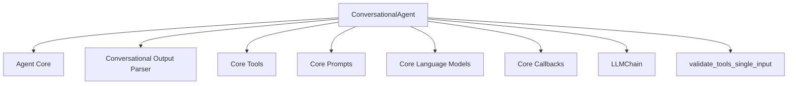

# conversational_agent_base

**Module Path:** `libs.langchain.langchain_classic.agents.conversational.base`

This module defines the `ConversationalAgent` class, an agent designed to maintain a conversation while effectively utilizing a suite of tools. It integrates language models with conversational memory and external utilities to provide a robust framework for building interactive AI agents.

## Core Functionality

### ConversationalAgent

`class ConversationalAgent(Agent)`

The `ConversationalAgent` extends the `Agent` base class, providing enhanced capabilities for conversational interactions. It manages chat history, formats prompts for tool usage, and parses the language model's output to continue the conversation or execute tools.

#### Attributes:

*   **`ai_prefix`**: `str = "AI"`
    *   The prefix used before the AI's output in the conversation.
*   **`output_parser`**: `AgentOutputParser`
    *   An instance of `AgentOutputParser` (defaults to `ConvoOutputParser`) responsible for parsing the agent's thoughts and actions from the language model's output.

#### Properties:

*   **`_agent_type`**: `str`
    *   Returns the identifier for this agent type, which is `AgentType.CONVERSATIONAL_REACT_DESCRIPTION`.
*   **`observation_prefix`**: `str`
    *   Returns `"Observation: "` as the prefix for observations.
*   **`llm_prefix`**: `str`
    *   Returns `"Thought:"` as the prefix for the language model's thoughts.

#### Methods:

*   **`_get_default_output_parser(cls, ai_prefix: str = "AI", **kwargs: Any) -> AgentOutputParser`**
    *   Returns a `ConvoOutputParser` instance, optionally configured with a custom `ai_prefix`.

*   **`create_prompt(cls, tools: Sequence[BaseTool], prefix: str = PREFIX, suffix: str = SUFFIX, format_instructions: str = FORMAT_INSTRUCTIONS, ai_prefix: str = "AI", human_prefix: str = "Human", input_variables: list[str] | None = None) -> PromptTemplate`**
    *   Generates a `PromptTemplate` tailored for the conversational agent, incorporating a list of available tools, predefined prefixes, suffixes, and formatting instructions. It dynamically structures the prompt to guide the language model in tool selection and conversational flow.

*   **`_validate_tools(cls, tools: Sequence[BaseTool]) -> None`**
    *   Validates the provided list of tools to ensure they meet the agent's requirements, specifically checking for single-input tools.

*   **`from_llm_and_tools(cls, llm: BaseLanguageModel, tools: Sequence[BaseTool], callback_manager: BaseCallbackManager | None = None, output_parser: AgentOutputParser | None = None, prefix: str = PREFIX, suffix: str = SUFFIX, format_instructions: str = FORMAT_INSTRUCTIONS, ai_prefix: str = "AI", human_prefix: str = "Human", input_variables: list[str] | None = None, **kwargs: Any) -> Agent`**
    *   A class method to construct a `ConversationalAgent` instance from a given language model (`LLM`) and a set of `tools`. It initializes the agent's internal `LLMChain` with a dynamically created prompt and configures the output parser. This is the primary factory method for creating `ConversationalAgent` instances.

## Architecture and Component Relationships

The `conversational_agent_base` module, primarily through its `ConversationalAgent` class, acts as a central orchestrator within the `classic_agents` ecosystem for conversational AI. It depends on several core components for its operation:

<!-- DIAGRAM_JSON
{
    "direction": "TD",
    "nodes": [
        {"id": "conversational_agent", "label": "ConversationalAgent", "type": "component", "link": null},
        {"id": "agent_core", "label": "Agent Core", "type": "external", "link": "agent_core.md"},
        {"id": "conversational_output_parser", "label": "Conversational Output Parser", "type": "external", "link": "conversational_output_parser.md"},
        {"id": "core_tools", "label": "Core Tools", "type": "external", "link": "core_tools.md"},
        {"id": "core_prompts", "label": "Core Prompts", "type": "external", "link": "core_prompts.md"},
        {"id": "core_language_models", "label": "Core Language Models", "type": "external", "link": "core_language_models.md"},
        {"id": "core_callbacks", "label": "Core Callbacks", "type": "external", "link": "core_callbacks.md"},
        {"id": "llm_chain", "label": "LLMChain", "type": "external", "link": null},
        {"id": "validate_tools_single_input", "label": "validate_tools_single_input", "type": "external", "link": null}
    ],
    "edges": [
        {"source": "conversational_agent", "target": "agent_core"},
        {"source": "conversational_agent", "target": "conversational_output_parser"},
        {"source": "conversational_agent", "target": "core_tools"},
        {"source": "conversational_agent", "target": "core_prompts"},
        {"source": "conversational_agent", "target": "core_language_models"},
        {"source": "conversational_agent", "target": "core_callbacks"},
        {"source": "conversational_agent", "target": "llm_chain"},
        {"source": "conversational_agent", "target": "validate_tools_single_input"}
    ],
    "groups": []
}
-->

## How the Module Fits into the Overall System

The `conversational_agent_base` module is a fundamental part of the `classic_agents` suite, specifically within the `conversational_agents` family. It builds upon the general `Agent` abstraction (from [agent_core.md](agent_core.md)) to introduce conversational capabilities. By integrating with `core_language_models` for processing and `core_tools` for external interactions, it provides a robust foundation for agents that can engage in multi-turn dialogues while still leveraging external functionalities.

It works in conjunction with the [conversational_output_parser.md](conversational_output_parser.md) module to interpret the language model's responses into actionable commands or conversational replies. Its `from_llm_and_tools` factory method simplifies the instantiation of conversational agents, making it easy to create complex, interactive AI systems using various language models and tools.