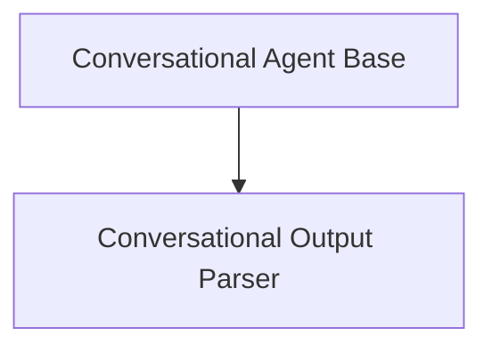

# Conversational Agent Module

## Introduction

The `conversational_agent_module` provides the foundational components for building conversational AI agents that can interact with users and utilize various tools. This module defines the core agent logic and its associated output parsing mechanism, enabling robust and engaging dialogue systems.

## Architecture Overview

The module is composed of two primary sub-modules:

- **Conversational Agent Base**: Defines the core `ConversationalAgent` class.
- **Conversational Output Parser**: Handles the parsing of the agent's output.

These sub-modules work in tandem to facilitate the agent's ability to process natural language input, decide on actions using available tools, and generate appropriate responses.

<!-- DIAGRAM_JSON
{
    "direction": "TD",
    "nodes": [
        {"id": "conversational_agent_base", "label": "Conversational Agent Base", "type": "module", "link": "conversational_agent_base.md"},
        {"id": "conversational_output_parser", "label": "Conversational Output Parser", "type": "module", "link": "conversational_output_parser.md"}
    ],
    "edges": [
        {"source": "conversational_agent_base", "target": "conversational_output_parser"}
    ],
    "groups": []
}
-->

## Sub-modules

### Conversational Agent Base

This sub-module, documented in [conversational_agent_base.md](conversational_agent_base.md), contains the `ConversationalAgent` class. This class extends the base `Agent` and provides the necessary logic for an AI to maintain a conversation while intelligently deciding when and how to use external tools. It includes methods for creating prompts and validating tools, ensuring the agent operates effectively within its conversational context.

### Conversational Output Parser

Detailed in [conversational_output_parser.md](conversational_output_parser.md), this sub-module features the `ConvoOutputParser` class. Its primary role is to interpret the raw text output from the language model, distinguishing between a final conversational response and an instruction to use a tool (AgentAction). This parser is crucial for the agent's ability to execute actions and continue the dialogue seamlessly.