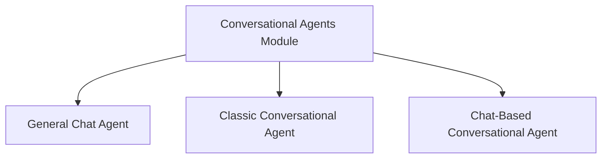

# Conversational Agents Module

The `conversational_agents` module within `langchain_classic.agents` provides a suite of tools and classes for building intelligent agents capable of engaging in conversational interactions and leveraging external tools to achieve tasks. This module is fundamental for creating dynamic and interactive AI systems that can understand context, maintain dialogue history, and execute actions based on user input.

## Architecture Overview

The module's architecture is centered around different types of conversational agents, each designed with specific strengths and use cases. These agents share common functionalities like prompt creation and tool validation but differ in their internal mechanisms for handling conversational flow and parsing outputs. The relationships between the core components are illustrated in the diagram below.

<!-- DIAGRAM_JSON
{
    "direction": "TD",
    "nodes": [
        {"id": "conversational_agents", "label": "Conversational Agents Module", "type": "module", "link": "conversational_agents.md"},
        {"id": "chat_agent_module", "label": "General Chat Agent", "type": "module", "link": "chat_agent_module.md"},
        {"id": "conversational_agent_module", "label": "Classic Conversational Agent", "type": "module", "link": "conversational_agent_module.md"},
        {"id": "conversational_chat_agent_module", "label": "Chat-Based Conversational Agent", "type": "module", "link": "conversational_chat_agent_module.md"}
    ],
    "edges": [
        {"source": "conversational_agents", "target": "chat_agent_module"},
        {"source": "conversational_agents", "target": "conversational_agent_module"},
        {"source": "conversational_agents", "target": "conversational_chat_agent_module"}
    ],
    "groups": []
}
-->

## Sub-modules

### [General Chat Agent](chat_agent_module.md)
The `chat_agent_module` introduces a foundational agent for general chat interactions. It extends the base `Agent` class, providing specialized methods for constructing conversational scratchpads, validating tools, and generating prompts tailored for chat-based models. It utilizes a `ChatOutputParser` for processing agent responses.

### [Classic Conversational Agent](conversational_agent_module.md)
The `conversational_agent_module` defines an agent specifically designed for conversational flows, allowing it to maintain dialogue context while also interacting with tools. This module includes the `ConversationalAgent` class, which incorporates an `ai_prefix` for agent outputs and leverages a `ConvoOutputParser` to interpret conversational responses and tool actions.

### [Chat-Based Conversational Agent](conversational_chat_agent_module.md)
The `conversational_chat_agent_module` provides an agent tailored for use with chat models. It combines conversational capabilities with robust tool usage, incorporating `chat_history` and `agent_scratchpad` into its prompt construction. This agent also utilizes the `ConvoOutputParser` for handling its output.
