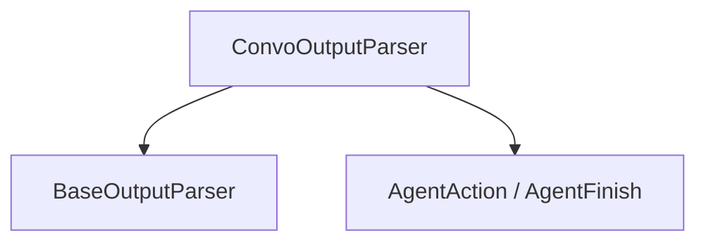

# conversational_output_parser

This module provides the `ConvoOutputParser`, a specialized output parser designed for conversational agents. Its primary function is to interpret the raw text output from an agent and transform it into structured `AgentAction` or `AgentFinish` objects, enabling the agent to either take further steps or conclude its operation with a final response.

## Architecture and Component Relationships

The `conversational_output_parser` module is a leaf module within the `conversational_agent_module` of the `classic_agents` package. It focuses solely on parsing agent outputs in a conversational context.

<!-- DIAGRAM_JSON
{
    "direction": "TD",
    "nodes": [
        {"id": "convo_output_parser", "label": "ConvoOutputParser", "type": "component", "link": null},
        {"id": "agent_output_parser", "label": "BaseOutputParser", "type": "external", "link": "core_output_parsers.md"},
        {"id": "agent_action_finish", "label": "AgentAction / AgentFinish", "type": "external", "link": "core_agents.md"}
    ],
    "edges": [
        {"source": "convo_output_parser", "target": "agent_output_parser"},
        {"source": "convo_output_parser", "target": "agent_action_finish"}
    ],
    "groups": []
}
-->

## Core Functionality

### `ConvoOutputParser`

`libs.langchain.langchain_classic.agents.conversational.output_parser.ConvoOutputParser`

This class is responsible for parsing the textual output generated by a conversational agent. It extends `AgentOutputParser` and defines how to extract either a final AI response or an action for the agent to take.

-   **`ai_prefix`**: A configurable prefix (default: "AI") used to identify when the output is a direct response from the AI, indicating an `AgentFinish`.
-   **`format_instructions`**: Contains the default instructions for how the agent's output should be formatted.

#### Methods

-   **`get_format_instructions() -> str`**
    Returns the formatting instructions that the conversational agent should adhere to when generating its output.

-   **`parse(self, text: str) -> AgentAction | AgentFinish`**
    This is the core parsing method. It inspects the input `text`:
    -   If the `ai_prefix` is found, it assumes the text after the prefix is the final AI output and returns an `AgentFinish` object.
    -   Otherwise, it attempts to parse the text using a regular expression to extract an `Action` and `Action Input`, returning an `AgentAction` object. If parsing fails, it raises an `OutputParserException`.

-   **`_type`**: A property that returns the string "conversational", identifying the type of this output parser.

## Integration with the Overall System

The `conversational_output_parser` module plays a crucial role in the `conversational_agent_module` by enabling the agent to understand and act upon its own outputs or provide a coherent final response to the user. It depends on core abstractions from `core_output_parsers` for its base functionality and `core_agents` for the `AgentAction` and `AgentFinish` structures. This module ensures that conversational flows are correctly managed, transitioning between tool execution and direct user interaction seamlessly based on the agent's output format.

Refer to the [core_output_parsers](core_output_parsers.md) documentation for more details on base output parser functionalities and [core_agents](core_agents.md) for information on `AgentAction` and `AgentFinish`.