# conversational_retrieval_chain_impl

## Introduction

The `conversational_retrieval_chain_impl` module provides the implementation for the `ConversationalRetrievalChain`, a class designed to facilitate conversations with an AI model based on retrieved documents and chat history. This chain is crucial for building applications that can answer questions accurately by contextualizing new queries with past conversation turns and retrieving relevant information.

## Architecture and Component Relationships

The `ConversationalRetrievalChain` operates by orchestrating three main steps:
1.  **Question Generation:** It first takes the chat history and the latest user question to generate a "standalone question." This standalone question is formulated to be self-contained, allowing for effective document retrieval without relying on the broader conversational context during the retrieval step.
2.  **Document Retrieval:** The standalone question is then passed to a retriever, which fetches relevant documents from a knowledge base.
3.  **Answer Generation:** Finally, the retrieved documents, along with either the new question (default) or the original question and chat history, are fed into a Language Model (LLM) to generate a concise and accurate answer.

### Core Components

The primary component of this module is:

-   `ConversationalRetrievalChain`: This class orchestrates the entire conversational retrieval process. It manages the integration of a retriever, a chain for combining documents, and a question generator.

### Module Dependencies

The `conversational_retrieval_chain_impl` module depends on several external components and modules to perform its functions:

-   **`BaseRetriever`**: An interface for document retrieval. (Refer to [core_retrievers.md](core_retrievers.md) for more details).
-   **`StuffDocumentsChain`**: A chain for combining multiple documents into a single input for an LLM. (Refer to [classic_chains_base.md](classic_chains_base.md) for more details).
-   **`LLMChain`**: A foundational chain for running language models. (Refer to [classic_chains_base.md](classic_chains_base.md) for more details).
-   **`BaseLanguageModel`**: The base interface for language models. (Refer to [core_language_models.md](core_language_models.md) for more details).
-   **`BasePromptTemplate`**: The base interface for prompt templates. (Refer to [core_prompts.md](core_prompts.md) for more details).
-   **`load_qa_chain`**: A utility function to load various types of QA chains. (Refer to [classic_chains_loading.md](classic_chains_loading.md) for more details).
-   **`create_history_aware_retriever`**: A function to create a retriever that considers chat history. (Refer to [history_aware_retrievers.md](history_aware_retrievers.md) for more details).
-   **`create_retrieval_chain`**: A utility for creating a complete retrieval chain. (Refer to [classic_chains_base.md](classic_chains_base.md) for more details).
-   **`create_stuff_documents_chain`**: A utility for creating a chain that combines documents by stuffing them. (Refer to [classic_chains_base.md](classic_chains_base.md) for more details).
-   **`ChatPromptTemplate` and `MessagesPlaceholder`**: Components for constructing chat-specific prompts. (Refer to [core_prompts.md](core_prompts.md) for more details).
-   **`ChatOpenAI` and `OpenAI`**: Specific language model implementations. (Refer to [partners_openai_chat_models.md](partners_openai_chat_models.md) for more details).
-   **`Document`**: Represents a piece of text content. (Refer to [core_document_loaders.md](core_document_loaders.md) for more details).
-   **`CallbackManagerForChainRun` and `AsyncCallbackManagerForChainRun`**: Used for managing callbacks during chain execution. (Refer to [core_callbacks.md](core_callbacks.md) for more details).

<!-- DIAGRAM_JSON
{
    "direction": "TD",
    "nodes": [
        {"id": "ConversationalRetrievalChain", "label": "ConversationalRetrievalChain", "type": "component", "link": null},
        {"id": "_reduce_tokens_below_limit", "label": "_reduce_tokens_below_limit", "type": "component", "link": null},
        {"id": "_get_docs", "label": "_get_docs", "type": "component", "link": null},
        {"id": "_aget_docs", "label": "_aget_docs", "type": "component", "link": null},
        {"id": "from_llm", "label": "from_llm", "type": "component", "link": null},
        {"id": "condense_question_prompt_const", "label": "CONDENSE_QUESTION_PROMPT", "type": "component", "link": null},
        {"id": "BaseRetriever", "label": "BaseRetriever", "type": "external", "link": "core_retrievers.md"},
        {"id": "StuffDocumentsChain", "label": "StuffDocumentsChain", "type": "external", "link": "classic_chains_base.md"},
        {"id": "LLMChain", "label": "LLMChain", "type": "external", "link": "classic_chains_base.md"},
        {"id": "BaseLanguageModel", "label": "BaseLanguageModel", "type": "external", "link": "core_language_models.md"},
        {"id": "BasePromptTemplate", "label": "BasePromptTemplate", "type": "external", "link": "core_prompts.md"},
        {"id": "load_qa_chain", "label": "load_qa_chain", "type": "external", "link": "classic_chains_loading.md"},
        {"id": "create_history_aware_retriever_func", "label": "create_history_aware_retriever", "type": "external", "link": "history_aware_retrievers.md"},
        {"id": "create_retrieval_chain_func", "label": "create_retrieval_chain", "type": "external", "link": "classic_chains_base.md"},
        {"id": "create_stuff_documents_chain_func", "label": "create_stuff_documents_chain", "type": "external", "link": "classic_chains_base.md"},
        {"id": "ChatPromptTemplate_cls", "label": "ChatPromptTemplate", "type": "external", "link": "core_prompts.md"},
        {"id": "MessagesPlaceholder_cls", "label": "MessagesPlaceholder", "type": "external", "link": "core_prompts.md"},
        {"id": "ChatOpenAI_cls", "label": "ChatOpenAI", "type": "external", "link": "partners_openai_chat_models.md"},
        {"id": "OpenAI_cls", "label": "OpenAI", "type": "external", "link": "partners_openai_chat_models.md"},
        {"id": "Document_cls", "label": "Document", "type": "external", "link": "core_document_loaders.md"},
        {"id": "CallbackManager", "label": "CallbackManager", "type": "external", "link": "core_callbacks.md"}
    ],
    "edges": [
        {"source": "ConversationalRetrievalChain", "target": "_reduce_tokens_below_limit"},
        {"source": "ConversationalRetrievalChain", "target": "_get_docs"},
        {"source": "ConversationalRetrievalChain", "target": "_aget_docs"},
        {"source": "ConversationalRetrievalChain", "target": "from_llm"},
        {"source": "_reduce_tokens_below_limit", "target": "StuffDocumentsChain"},
        {"source": "_reduce_tokens_below_limit", "target": "Document_cls"},
        {"source": "_get_docs", "target": "BaseRetriever"},
        {"source": "_get_docs", "target": "CallbackManager"},
        {"source": "_get_docs", "target": "Document_cls"},
        {"source": "_aget_docs", "target": "BaseRetriever"},
        {"source": "_aget_docs", "target": "CallbackManager"},
        {"source": "_aget_docs", "target": "Document_cls"},
        {"source": "from_llm", "target": "BaseLanguageModel"},
        {"source": "from_llm", "target": "BaseRetriever"},
        {"source": "from_llm", "target": "BasePromptTemplate"},
        {"source": "from_llm", "target": "load_qa_chain"},
        {"source": "from_llm", "target": "LLMChain"},
        {"source": "from_llm", "target": "condense_question_prompt_const"},
        {"source": "from_llm", "target": "StuffDocumentsChain"},
        {"source": "from_llm", "target": "create_history_aware_retriever_func"},
        {"source": "from_llm", "target": "create_retrieval_chain_func"},
        {"source": "from_llm", "target": "create_stuff_documents_chain_func"},
        {"source": "LLMChain", "target": "BaseLanguageModel"},
        {"source": "LLMChain", "target": "BasePromptTemplate"}
    ],
    "groups": []
}
-->

```mermaid
graph TD
    ConversationalRetrievalChain[ConversationalRetrievalChain]
    _reduce_tokens_below_limit[_reduce_tokens_below_limit]
    _get_docs[_get_docs]
    _aget_docs[_aget_docs]
    from_llm[from_llm]
    condense_question_prompt_const[CONDENSE_QUESTION_PROMPT]
    BaseRetriever[BaseRetriever]:::external
    StuffDocumentsChain[StuffDocumentsChain]:::external
    LLMChain[LLMChain]:::external
    BaseLanguageModel[BaseLanguageModel]:::external
    BasePromptTemplate[BasePromptTemplate]:::external
    load_qa_chain[load_qa_chain]:::external
    create_history_aware_retriever_func[create_history_aware_retriever]:::external
    create_retrieval_chain_func[create_retrieval_chain]:::external
    create_stuff_documents_chain_func[create_stuff_documents_chain]:::external
    ChatPromptTemplate_cls[ChatPromptTemplate]:::external
    MessagesPlaceholder_cls[MessagesPlaceholder]:::external
    ChatOpenAI_cls[ChatOpenAI]:::external
    OpenAI_cls[OpenAI]:::external
    Document_cls[Document]:::external
    CallbackManager[CallbackManager]:::external

    ConversationalRetrievalChain --> _reduce_tokens_below_limit
    ConversationalRetrievalChain --> _get_docs
    ConversationalRetrievalChain --> _aget_docs
    ConversationalRetrievalChain --> from_llm
    _reduce_tokens_below_limit --> StuffDocumentsChain
    _reduce_tokens_below_limit --> Document_cls
    _get_docs --> BaseRetriever
    _get_docs --> CallbackManager
    _get_docs --> Document_cls
    _aget_docs --> BaseRetriever
    _aget_docs --> CallbackManager
    _aget_docs --> Document_cls
    from_llm --> BaseLanguageModel
    from_llm --> BaseRetriever
    from_llm --> BasePromptTemplate
    from_llm --> load_qa_chain
    from_llm --> LLMChain
    from_llm --> condense_question_prompt_const
    from_llm --> StuffDocumentsChain
    from_llm --> create_history_aware_retriever_func
    from_llm --> create_retrieval_chain_func
    from_llm --> create_stuff_documents_chain_func
    LLMChain --> BaseLanguageModel
    LLMChain --> BasePromptTemplate

    classDef external fill:#f9f,stroke:#333,stroke-width:2px;
```

## How the Module Fits into the Overall System

The `conversational_retrieval_chain_impl` module is a core component within the `classic_chains_conversational` package, specifically under `conversational_retrieval_chains`. It provides a concrete implementation for a widely used pattern in conversational AI: retrieving information based on an ongoing dialogue.

This module is designed to be highly extensible, allowing developers to plug in different types of retrievers, language models, and document combination strategies. It serves as a building block for more complex conversational agents that require access to external knowledge bases.

While the `ConversationalRetrievalChain` itself is marked as deprecated in favor of a newer, more modular approach using `create_retrieval_chain`, `create_history_aware_retriever`, and `create_stuff_documents_chain`, understanding its implementation is crucial for comprehending the underlying principles of conversational retrieval and for maintaining existing systems that might still utilize this class. The provided examples in its docstring demonstrate how to achieve similar functionality with the recommended newer components, showcasing the evolution of the LangChain framework towards greater flexibility and composability.

Its position within `classic_chains_conversational` signifies its role in handling conversational flows, making it an essential part of any system requiring intelligent dialogue with document-grounded responses. It bridges the gap between raw user input, historical context, and external data sources to generate coherent and informed replies.