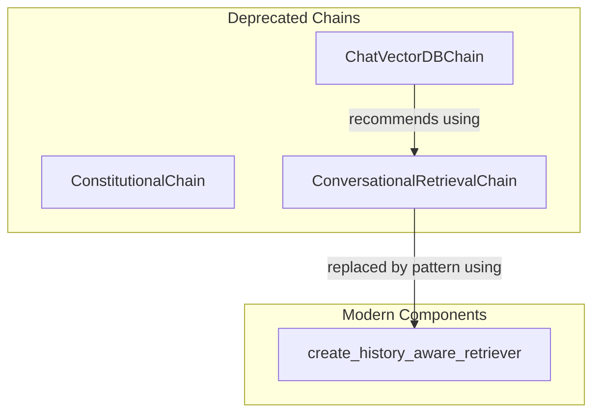

# conversational_retrieval_chains
This module contains components for conversational retrieval, including deprecated chain implementations and a modern utility for history-aware retrieval.

<!-- DIAGRAM_JSON
{
    "nodes": [
        {
            "id": "C1",
            "label": "ConstitutionalChain"
        },
        {
            "id": "C2",
            "label": "ConversationalRetrievalChain"
        },
        {
            "id": "C3",
            "label": "ChatVectorDBChain"
        },
        {
            "id": "F1",
            "label": "create_history_aware_retriever"
        }
    ],
    "edges": [
        {
            "source": "C3",
            "target": "C2",
            "label": "recommends using"
        },
        {
            "source": "C2",
            "target": "F1",
            "label": "replaced by pattern using"
        }
    ],
    "groups": [
        {
            "id": "deprecated",
            "label": "Deprecated Chains",
            "nodes": [
                "C1",
                "C2",
                "C3"
            ]
        },
        {
            "id": "modern",
            "label": "Modern Components",
            "nodes": [
                "F1"
            ]
        }
    ]
}
-->
