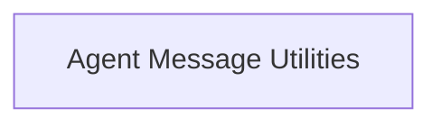

# Core Agents Module Documentation

## Introduction

The `core_agents` module provides fundamental utilities for managing agent actions and their interactions within the Langchain Core framework. It primarily focuses on the conversion of agent actions and observations into standardized message formats, facilitating seamless communication between different components of an agent-based system.

## Architecture Overview

The `core_agents` module is structured around its core responsibility of translating internal agent activities into a consistent messaging protocol. The main functional block within this module is focused on message conversion, which is crucial for logging, processing, and responding to agent actions.

<!-- DIAGRAM_JSON
{
    "direction": "TD",
    "nodes": [
        {"id": "agent_message_utilities", "label": "Agent Message Utilities", "type": "module", "link": "agent_message_utilities.md"}
    ],
    "edges": [],
    "groups": []
}
-->

## Sub-modules

### [Agent Message Utilities](agent_message_utilities.md)
This sub-module contains functions responsible for converting `AgentAction` objects and their observations into standard `BaseMessage` types, such as `AIMessage` and `FunctionMessage`. These utilities are critical for the agent's ability to communicate its actions and tool invocation results effectively within the system.
