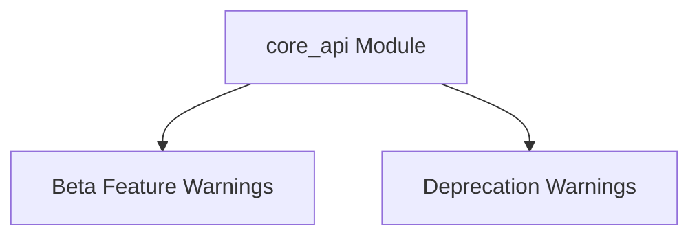

# core_api Module Documentation

The `core_api` module provides core API functionalities, primarily focusing on managing and emitting warnings for beta features and deprecated functionalities within the system. It ensures that developers are properly notified about API stability changes, promoting better code maintenance and compatibility.

## Architecture Overview

The `core_api` module is composed of two main sub-modules: `beta_warnings` and `deprecation_warnings`. These modules encapsulate the logic for different types of warning emissions, maintaining a clear separation of concerns.

<!-- DIAGRAM_JSON
{
    "direction": "TD",
    "nodes": [
        {"id": "beta_warnings", "label": "Beta Feature Warnings", "type": "module", "link": "beta_warnings.md"},
        {"id": "deprecation_warnings", "label": "Deprecation Warnings", "type": "module", "link": "deprecation_warnings.md"}
    ],
    "edges": [
        {"source": "core_api", "target": "beta_warnings"},
        {"source": "core_api", "target": "deprecation_warnings"}
    ],
    "groups": []
}
-->

## Sub-modules

### [Beta Feature Warnings](beta_warnings.md)

This sub-module handles the emission of warnings for features that are currently in a beta stage. It provides mechanisms to warn users about the experimental nature of certain API components, covering synchronous functions, asynchronous functions, and property accessors.

### [Deprecation Warnings](deprecation_warnings.md)

This sub-module is responsible for managing and issuing warnings for deprecated functionalities. It ensures that users are alerted when they are using an API component that is scheduled for removal, promoting timely migration to newer alternatives.