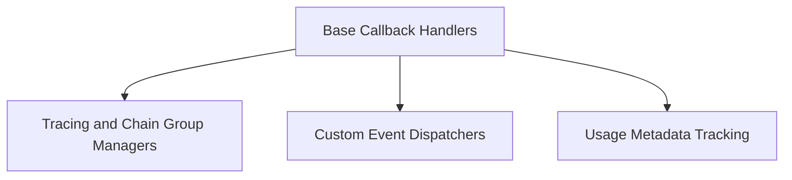

# Core Callbacks Module

## Introduction and Purpose

The `core_callbacks` module provides a flexible and extensible system for handling events and interactions within the LangChain framework. It allows developers to hook into various stages of a language model (LLM), chain, tool, or agent's execution, enabling custom logging, monitoring, tracing, and event dispatching. This module is crucial for debugging, performance analysis, and integrating with external systems.

## Architecture Overview

The `core_callbacks` module is structured into several key sub-modules, each responsible for a specific aspect of callback management. The architecture is designed to be modular, allowing for easy extension and customization of callback behavior.

<!-- DIAGRAM_JSON
{
    "direction": "TD",
    "nodes": [
        {"id": "base_handlers", "label": "Base Callback Handlers", "type": "module", "link": "base_handlers.md"},
        {"id": "trace_managers", "label": "Tracing and Chain Group Managers", "type": "module", "link": "trace_managers.md"},
        {"id": "event_dispatchers", "label": "Custom Event Dispatchers", "type": "module", "link": "event_dispatchers.md"},
        {"id": "usage_tracking", "label": "Usage Metadata Tracking", "type": "module", "link": "usage_tracking.md"}
    ],
    "edges": [
        {"source": "base_handlers", "target": "trace_managers"},
        {"source": "base_handlers", "target": "event_dispatchers"},
        {"source": "base_handlers", "target": "usage_tracking"}
    ],
    "groups": []
}
-->

## Sub-modules

### [Base Callback Handlers](base_handlers.md)
This sub-module provides the foundational classes for handling various events throughout the execution flow. It includes both synchronous and asynchronous callback handlers, as well as a file-based callback handler for persistent logging.

### [Tracing and Chain Group Managers](trace_managers.md)
This sub-module focuses on managing and grouping related operations into logical chains for enhanced tracing and monitoring. It supports both synchronous and asynchronous execution flows, making it essential for understanding the overall system behavior and performance.

### [Custom Event Dispatchers](event_dispatchers.md)
This sub-module facilitates the dispatching of arbitrary custom events within the callback system. It allows developers to define and handle application-specific events, providing a powerful mechanism for extending the framework's functionality and integrating with custom logic.

### [Usage Metadata Tracking](usage_tracking.md)
This sub-module is dedicated to collecting and tracking usage metadata from language model interactions. It provides a specialized callback handler that gathers metrics such as token counts and other relevant information, which is valuable for cost analysis, resource management, and performance optimization.