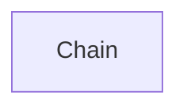

# core_chains
This module defines the `Chain` abstract base class, providing a structured interface for sequences of calls to components like models and retrievers. It enables stateful, observable, and composable application flows.

<!-- DIAGRAM_JSON
{
    "nodes": [
        {
            "id": "Chain",
            "label": "Chain",
            "type": "class"
        }
    ],
    "edges": [],
    "groups": []
}
-->
