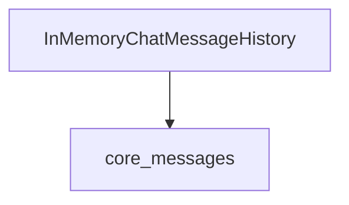

# `core_chat_history` Module Documentation

## Introduction

The `core_chat_history` module provides functionalities for managing and storing chat message histories. Its primary purpose is to offer a simple, in-memory solution for maintaining a sequence of chat messages within an application's lifecycle. This module is crucial for applications requiring a stateless yet immediate way to track conversational turns.

## Architecture and Component Relationships

The `core_chat_history` module contains the `InMemoryChatMessageHistory` component, which serves as the concrete implementation for storing chat messages in memory. It depends on core message structures defined in the `core_messages` module.

<!-- DIAGRAM_JSON
{
    "direction": "TD",
    "nodes": [
        {"id": "in_memory_chat_message_history", "label": "InMemoryChatMessageHistory", "type": "component", "link": null},
        {"id": "core_messages", "label": "core_messages", "type": "external", "link": "core_messages.md"}
    ],
    "edges": [
        {"source": "in_memory_chat_message_history", "target": "core_messages"}
    ],
    "groups": []
}
-->

### `InMemoryChatMessageHistory`

This class provides an in-memory implementation for storing chat messages. It stores messages in a standard Python list and offers methods for adding, retrieving, and clearing messages, including asynchronous versions for potential future integration with asynchronous persistence layers.

**Core Functionality:**
- **Message Storage**: Utilizes a list to store `BaseMessage` objects, maintaining the order of the conversation.
- **Message Management**: Provides `add_message` and `aadd_messages` to append new messages, and `clear` and `aclear` to reset the history.
- **Message Retrieval**: Offers `aget_messages` to retrieve all stored messages.

**Dependencies:**
- `core_messages`: Relies on the `BaseMessage` type for its message objects and `BaseChatMessageHistory` as its base class, which are defined in the `core_messages` module.

## How the Module Fits into the Overall System

The `core_chat_history` module provides a foundational building block for conversational AI applications by offering a simple yet effective way to manage chat history. It can be integrated with various components:

- **Language Models**: To provide conversational context to language models, allowing them to generate more coherent and relevant responses.
- **Agents**: Agents can utilize this module to maintain a history of interactions, enabling them to make informed decisions based on past turns.
- **UI Components**: Front-end interfaces can leverage this module to display and manage the flow of conversations.

This module acts as a concrete implementation of the abstract `BaseChatMessageHistory` interface, making it easily swappable with other chat history implementations (e.g., database-backed, persistent storage) without affecting the core logic of components that rely on the `BaseChatMessageHistory` interface.
