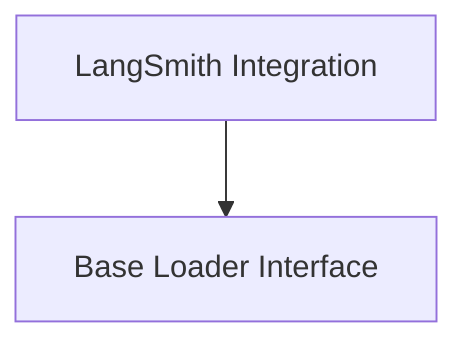

# Core Document Loaders

The `core_document_loaders` module provides a foundational framework for loading various types of documents into a standardized `Document` format. It supports both synchronous and asynchronous loading, as well as integration with external platforms like LangSmith for dataset ingestion. This module is essential for data preparation, enabling other components of the system to process and utilize diverse data sources effectively.

## Architecture

The `core_document_loaders` module is structured into key sub-modules that handle the core loading interface and specific integrations. The `base_loader_interface` defines the common contract for all loaders, while the `langsmith_integration` provides capabilities for loading data from LangSmith datasets.

<!-- DIAGRAM_JSON
{
    "direction": "TD",
    "nodes": [
        {"id": "base_loader_interface", "label": "Base Loader Interface", "type": "module", "link": "base_loader_interface.md"},
        {"id": "langsmith_integration", "label": "LangSmith Integration", "type": "module", "link": "langsmith_integration.md"}
    ],
    "edges": [
        {"source": "langsmith_integration", "target": "base_loader_interface"}
    ],
    "groups": []
}
-->

## Sub-modules

### [Base Loader Interface](base_loader_interface.md)
This sub-module defines the abstract `BaseLoader` class, which serves as the fundamental interface for all document loading operations. It provides methods for `load`, `aload` (asynchronous load), and `load_and_split` documents, ensuring a consistent approach to data ingestion across the system.

### [LangSmith Integration](langsmith_integration.md)
This sub-module facilitates the loading of dataset examples from LangSmith. It includes the `LangSmithLoader` class, which retrieves examples and converts them into `Document` objects, and a utility function `_stringify` for formatting content.
