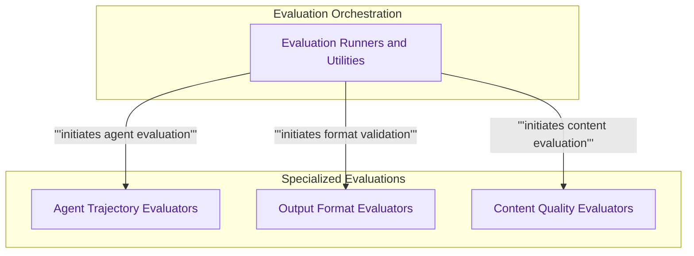

# Core Evaluators
This module provides a comprehensive framework for evaluating AI model outputs and agent trajectories, including tools for validating output formats, assessing content quality, and running dataset-driven evaluations.

<!-- DIAGRAM_JSON
{
    "direction": "TD",
    "nodes": [
        {"id": "evaluation_runners", "label": "Evaluation Runners and Utilities", "type": "module", "link": "evaluation_runners.md"},
        {"id": "agent_evaluators", "label": "Agent Trajectory Evaluators", "type": "module", "link": "agent_evaluators.md"},
        {"id": "output_format_evaluators", "label": "Output Format Evaluators", "type": "module", "link": "output_format_evaluators.md"},
        {"id": "content_quality_evaluators", "label": "Content Quality Evaluators", "type": "module", "link": "content_quality_evaluators.md"}
    ],
    "edges": [
        {"source": "evaluation_runners", "target": "agent_evaluators", "label": "initiates agent evaluation"},
        {"source": "evaluation_runners", "target": "output_format_evaluators", "label": "initiates format validation"},
        {"source": "evaluation_runners", "target": "content_quality_evaluators", "label": "initiates content evaluation"}
    ],
    "groups": [
        {"id": "orchestration", "label": "Evaluation Orchestration", "role": "analytical", "nodes": ["evaluation_runners"]},
        {"id": "evaluations", "label": "Specialized Evaluations", "role": "analytical", "nodes": ["agent_evaluators", "output_format_evaluators", "content_quality_evaluators"]}
    ]
}
-->

