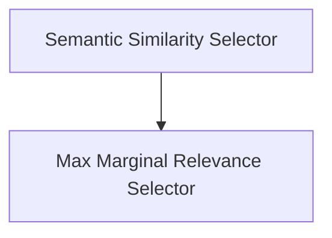

# Core Example Selectors

The `core_example_selectors` module provides mechanisms for intelligently selecting examples to be used in language model prompts. This is crucial for few-shot learning, where providing relevant examples can significantly improve model performance. The module primarily focuses on selecting examples based on semantic similarity and maximum marginal relevance.

## Architecture Overview

The `core_example_selectors` module is composed of two main sub-modules, each responsible for a distinct example selection strategy. Both strategies leverage vector stores for efficient similarity search and example retrieval.

<!-- DIAGRAM_JSON
{
    "direction": "TD",
    "nodes": [
        {"id": "semantic_similarity_selector", "label": "Semantic Similarity Selector", "type": "module", "link": "semantic_similarity_selector.md"},
        {"id": "max_marginal_relevance_selector", "label": "Max Marginal Relevance Selector", "type": "module", "link": "max_marginal_relevance_selector.md"}
    ],
    "edges": [
        {"source": "semantic_similarity_selector", "target": "max_marginal_relevance_selector", "label": "Can be used in conjunction"}
    ],
    "groups": []
}
-->

## Sub-modules

### [Semantic Similarity Selector](semantic_similarity_selector.md)
This sub-module is responsible for selecting examples based on their semantic similarity to a given input. It utilizes a vector store to perform efficient similarity searches, retrieving the most relevant examples.

### [Max Marginal Relevance Selector](max_marginal_relevance_selector.md)
This sub-module implements example selection using Maximum Marginal Relevance (MMR). MMR aims to select examples that are not only relevant to the input but also diverse, thus preventing redundancy and improving the overall quality of the selected examples.
