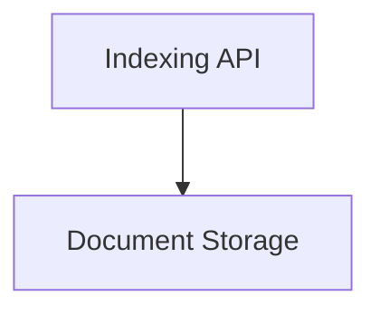

# Core Indexing Module

## Introduction and Purpose

The `core_indexing` module provides the foundational components and utilities for efficiently managing and indexing documents within the system. It offers mechanisms for adding, updating, deleting, and retrieving documents, focusing on data consistency and performance through features like asynchronous indexing, batch processing, and various cleanup strategies.

## Architecture Overview

The `core_indexing` module is structured into key sub-modules that handle distinct aspects of document management:

- **Indexing API**: Contains the core logic for orchestrating the indexing process, including asynchronous operations and utility functions for data manipulation.
- **Document Storage**: Defines the abstract interface for document storage and provides concrete implementations, enabling flexible integration with different storage backends.

<!-- DIAGRAM_JSON
{
    "direction": "TD",
    "nodes": [
        {"id": "indexing_api", "label": "Indexing API", "type": "module", "link": "indexing_api.md"},
        {"id": "document_storage", "label": "Document Storage", "type": "module", "link": "document_storage.md"}
    ],
    "edges": [
        {"source": "indexing_api", "target": "document_storage"}
    ],
    "groups": []
}
-->

## Sub-modules

Here's a brief overview of the sub-modules:

- [Indexing API](indexing_api.md): This sub-module provides the main asynchronous indexing function (`aindex`) and a utility for hashing nested dictionaries (`_hash_nested_dict`). The `aindex` function is responsible for managing the indexing lifecycle, including interaction with record managers and vector stores, handling batching, and defining cleanup strategies.

- [Document Storage](document_storage.md): This sub-module defines the `DocumentIndex` abstract base class, which serves as a generic interface for storing and querying documents. It also includes `InMemoryDocumentIndex`, a concrete implementation that stores documents in memory, offering basic search capabilities.
