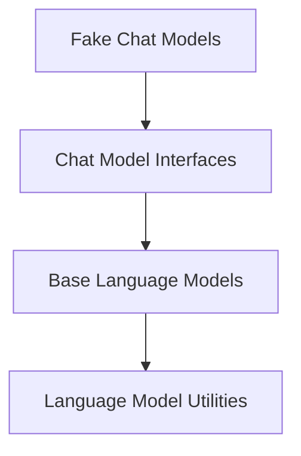

# Core Language Models Module Documentation

## Introduction and Purpose

The `core_language_models` module provides the foundational abstractions and concrete implementations for interacting with various language models, including both traditional Large Language Models (LLMs) and chat-based models. Its primary purpose is to offer a standardized interface for language model operations such as text generation, tokenization, and caching, ensuring consistency and ease of integration across different model types and providers. This module is critical for building robust and flexible applications that leverage language model capabilities.

## Architecture Overview

The `core_language_models` module is structured into several key sub-modules, each responsible for a specific aspect of language model management and interaction. The architecture emphasizes a clear separation of concerns, with core abstractions defining the fundamental contract for all language models, specialized interfaces for chat models, and dedicated components for testing and utility functions.

<!-- DIAGRAM_JSON
{
    "direction": "TD",
    "nodes": [
        {"id": "base_language_models", "label": "Base Language Models", "type": "module", "link": "base_language_models.md"},
        {"id": "chat_model_interfaces", "label": "Chat Model Interfaces", "type": "module", "link": "chat_model_interfaces.md"},
        {"id": "fake_chat_models", "label": "Fake Chat Models", "type": "module", "link": "fake_chat_models.md"},
        {"id": "language_model_utilities", "label": "Language Model Utilities", "type": "module", "link": "language_model_utilities.md"}
    ],
    "edges": [
        {"source": "chat_model_interfaces", "target": "base_language_models"},
        {"source": "fake_chat_models", "target": "chat_model_interfaces"},
        {"source": "base_language_models", "target": "language_model_utilities"}
    ],
    "groups": []
}
-->

## Sub-modules

This module is composed of the following sub-modules:

*   ### [Base Language Models](base_language_models.md)
    This sub-module defines the abstract base classes for all language models and large language models (LLMs), providing a foundational interface for core functionalities like generation, token counting, and caching.

*   ### [Chat Model Interfaces](chat_model_interfaces.md)
    This sub-module provides simplified interfaces for implementing chat-based language models, primarily for backwards compatibility and basic chat model functionalities.

*   ### [Fake Chat Models](fake_chat_models.md)
    This sub-module contains various fake chat model implementations used for testing, mocking responses, and simulating chat model behavior in development environments.

*   ### [Language Model Utilities](language_model_utilities.md)
    This sub-module includes utility functions and helper methods supporting the operation of language models, such as retry mechanisms with callback integration.
