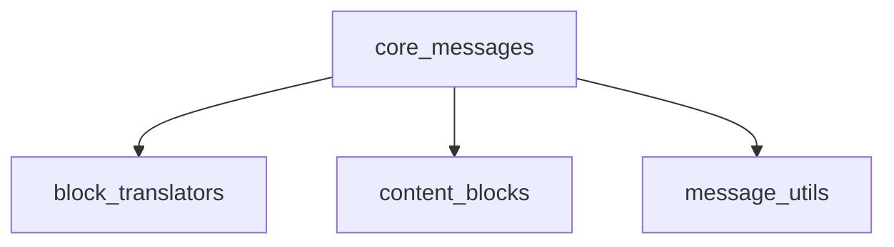

The `core_messages` module serves as the foundational layer for defining, creating, and manipulating various types of messages and their content blocks within the LangChain Core. It provides a standardized way to represent conversational turns, handle diverse media types, and facilitate translation between different Language Model (LLM) provider formats. This module is essential for building robust and flexible conversational AI applications by offering core abstractions for message structure and utility functions for their management.

### Architecture Overview

The `core_messages` module is structured into several key sub-modules, each responsible for a specific aspect of message handling: content creation, utility operations, and provider-specific content translation.

### Core Components Documentation

This module contains the following key sub-modules:

*   **`block_translators`**: This sub-module handles the translation of message content to and from formats specific to various LLM providers (e.g., Anthropic, Bedrock, Google GenAI, Groq, OpenAI), ensuring compatibility across different platforms.
    *   [Documentation for `block_translators`](block_translators.md)

*   **`content_blocks`**: This sub-module provides functions for creating and managing diverse content types within messages, such as text, images, videos, audio, and files, enabling rich multimedia conversations.
    *   [Documentation for `content_blocks`](content_blocks.md)

*   **`message_utils`**: This sub-module offers essential utility functions for common message operations, including approximating token counts, merging consecutive message runs, and filtering messages based on various criteria.
    *   [Documentation for `message_utils`](message_utils.md)